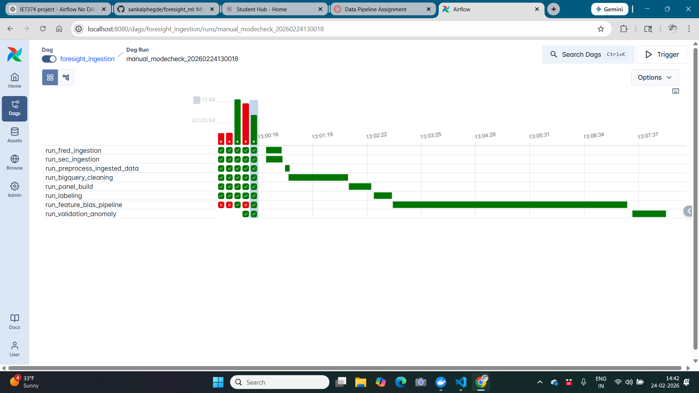
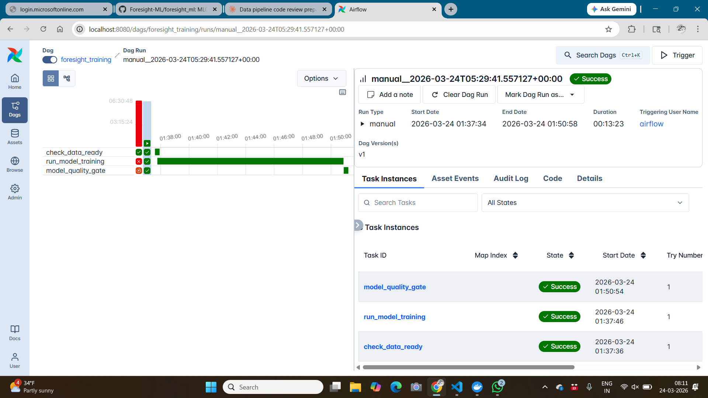
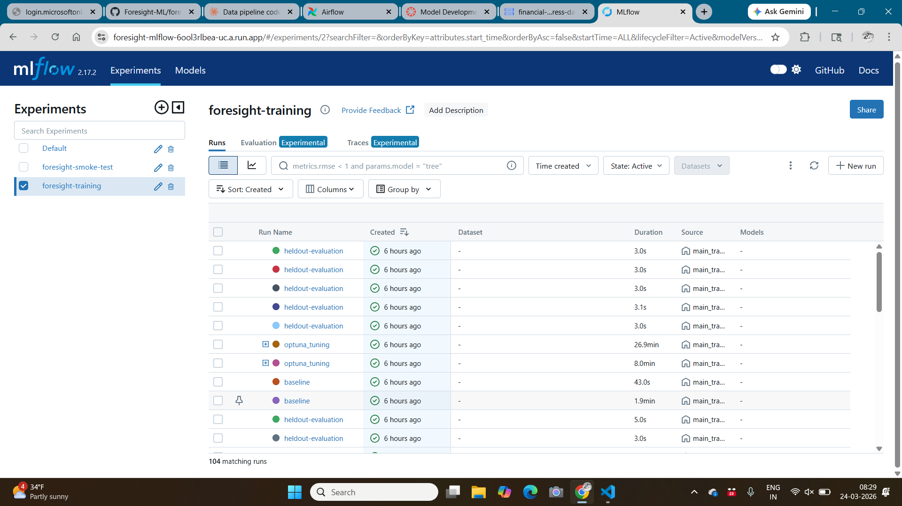
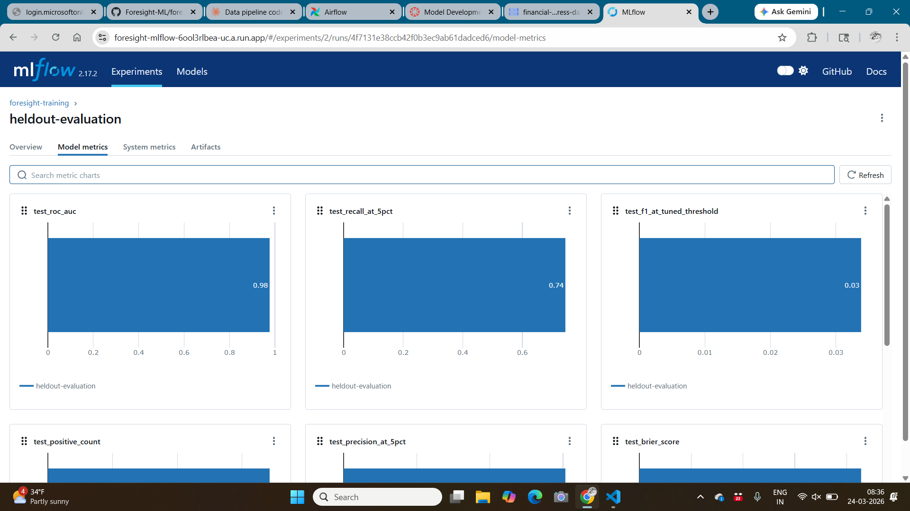
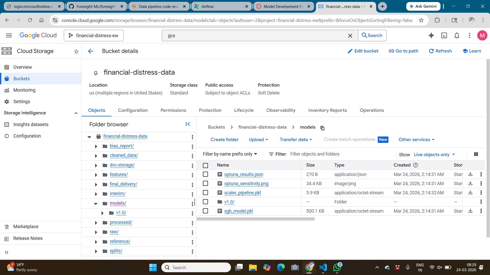

# Foresight-ML: Corporate Financial Distress Early-Warning System

End-to-end MLOps pipeline for predicting corporate financial distress 6–12 months in advance, using SEC EDGAR filings and FRED macroeconomic indicators.

---

## Table of Contents

- [Project Overview](#project-overview)
- [Architecture](#architecture)
- [Data Sources](#data-sources)
- [Data Ingestion](#data-ingestion)
- [Data Preprocessing](#data-preprocessing)
- [Feature Engineering & Bias Analysis](#feature-engineering--bias-analysis)
- [Distress Labeling](#distress-labeling)
- [Model Development](#model-development)
- [Airflow DAG Orchestration](#airflow-dag-orchestration)
- [CI/CD Pipeline](#cicd-pipeline)
- [DVC Data Versioning](#dvc-data-versioning)
- [MLflow Experiment Tracking](#mlflow-experiment-tracking)
- [Model Experiments Notebook](#model-experiments-notebook)
- [Validation & Anomaly Detection](#validation--anomaly-detection)
- [Bias Detection & Mitigation](#bias-detection--mitigation)
- [Infrastructure](#infrastructure)
- [Project Structure](#project-structure)
- [Local Setup & Quickstart](#local-setup--quickstart)
- [Running the Pipelines](#running-the-pipelines)
- [Testing](#testing)
- [Outputs & Artifacts](#outputs--artifacts)
- [Tech Stack](#tech-stack)

---

## Project Overview

Foresight-ML predicts corporate financial distress using machine learning applied to publicly available financial and macroeconomic data. The system generates quarterly risk scores per company, providing 6–12 month early warning signals before distress events occur.

The project is structured as a full MLOps system covering:
- Automated incremental data ingestion from SEC EDGAR and FRED APIs
- BigQuery-based cleaning and feature engineering
- Supervised model training (XGBoost + Optuna hyperparameter tuning)
- MLflow experiment tracking and model registry
- Airflow-orchestrated pipelines for both data and model phases
- CI/CD automation via GitHub Actions and Cloud Run
- DVC artifact versioning backed by GCS

---

## Architecture

```
┌─────────────────────────────────────────────────────────────┐
│              DATA PIPELINE (foresight_ingestion DAG)        │
│              Schedule: @daily                               │
└──────────────────┬──────────────────────────────────────────┘
                   │
       ┌───────────┴───────────┐
       ▼                       ▼
┌─────────────┐         ┌─────────────┐
│ FRED        │         │ SEC XBRL    │
│ Ingestion   │         │ Ingestion   │
│ (incremental│         │ (incremental│
│  revision-  │         │  amendment- │
│  safe)      │         │  safe)      │
└──────┬──────┘         └──────┬──────┘
       └──────────┬────────────┘
                  ▼
         ┌────────────────┐
         │ GCS Raw Zone   │
         │ raw/fred/*     │
         │ raw/sec_xbrl/* │
         └───────┬────────┘
                 ▼
         ┌────────────────┐
         │ BigQuery Clean │
         │ SQL transform  │
         │ final_v2 table │
         └───────┬────────┘
                 ▼
         ┌────────────────┐
         │ Panel Build +  │
         │ Distress Label │
         └───────┬────────┘
                 ▼
         ┌────────────────┐
         │ Feature Eng +  │
         │ Bias Analysis  │
         └───────┬────────┘
                 ▼
         ┌────────────────┐
         │ Validation +   │
         │ Anomaly Detect │
         └────────────────┘

┌─────────────────────────────────────────────────────────────┐
│             MODEL PIPELINE (foresight_training DAG)         │
│             Schedule: @weekly                               │
└──────────────────┬──────────────────────────────────────────┘
                   ▼
         ┌────────────────┐
         │ Data Gate      │
         │ (check labeled │
         │  panel exists) │
         └───────┬────────┘
                 ▼
         ┌────────────────┐
         │ Train + Tune   │
         │ (XGBoost +     │
         │  Optuna 25     │
         │  trials)       │
         └───────┬────────┘
                 ▼
         ┌────────────────┐
         │ Evaluate +     │
         │ Quality Gate   │
         │ ROC-AUC ≥ 0.80 │
         └───────┬────────┘
                 ▼
         ┌────────────────┐
         │ MLflow Model   │
         │ Registry +     │
         │ Rollback Check │
         └────────────────┘
```

**CI/CD Responsibility Split:**
- `cd-dev.yml` — builds and deploys ingestion Docker image to Cloud Run on ingestion code changes
- `model_training.yml` — builds and deploys training Docker image to Cloud Run on model code changes
- Both DAGs execute the respective Cloud Run jobs on their own schedules

---

## Data Sources

| Source | Type | Content | Access |
|---|---|---|---|
| SEC EDGAR XBRL API | Quarterly / Annual | Income statements, balance sheets, cash flows (10-Q/10-K) | Public API — requires User-Agent header |
| FRED (Federal Reserve) | Monthly / Weekly | Federal Funds Rate, CPI, credit spreads, unemployment | Public API — requires free API key |

All data is corporate-level and public. No PII is collected or stored.

---

## Data Ingestion

### SEC XBRL Ingestion (`src/ingestion/sec_xbrl_increment_job.py`)

Fetches quarterly XBRL financial statement data for companies in the configured universe.

**Company universe:** Loaded from `reference/companies.csv` in GCS. This file defines which companies are ingested.

> **Demo mode:** The current pipeline processes `companies_df.head(5)` — the first 5 companies from the reference file. This is an intentional runtime guardrail for submission and development. To process the full company universe, remove the `head(5)` line in `sec_xbrl_increment_job.py`.

**Incremental strategy (amendment-safe):**
1. For each company, fetch the full XBRL extract from SEC EDGAR
2. Identify the most recent 8 quarters in existing stored data
3. Drop those 8 quarters from the stored data (to capture any amendments)
4. Re-fetch and merge from the latest API response
5. Deduplicate on `(cik, fiscal_year, fiscal_period, tag)` keeping the latest

The 8-quarter refresh window covers the typical SEC amendment cycle without requiring a full reload on every run.

**Storage:** One Parquet file per company at `raw/sec_xbrl/cik=<CIK>/data.parquet`

**Normalization applied:**
- CIK zero-padded to 10 digits for consistent joining
- Only quarterly periods (Q1–Q4) retained; annual FY tags filtered out
- `quarter_key` composite field created (e.g., `2023_Q3`) as merge key

### FRED Ingestion (`src/ingestion/fred_increment_job.py`)

Fetches macroeconomic indicator time series from the FRED API.

**Indicators fetched:** Federal Funds Rate, CPI, credit spreads, unemployment, and GDP growth proxies.

**Incremental strategy (revision-safe):**
1. Fetch full time series from FRED API at native frequency
2. Normalize to quarterly by converting to quarter-end date and taking the last value per quarter
3. Drop the most recent 8 quarters from existing stored data (FRED regularly revises historical values)
4. Merge fresh data with older stable data
5. Deduplicate by date, keeping the latest value

**Storage:** One Parquet file per series at `raw/fred/series_id=<ID>.parquet`

**Why quarterly normalization?** All downstream features are quarterly (matching SEC filing cadence). Taking the last value per quarter provides the most current macro reading at quarter-end.

---

## Data Preprocessing

### BigQuery Cleaning (`src/data/cleaned/data_cleaned.sql`)

After ingestion, a SQL transform runs in BigQuery to produce the cleaned dataset.

**Steps in order:**

1. **Pivot SEC long → wide** (`sec_wide`): Converts XBRL long-format (one row per tag) to wide-format (one row per company-quarter) using `MAX(CASE WHEN tag=... THEN value END)`

2. **Pivot FRED timeseries → wide** (`fred_wide`): Aligns macro indicators to quarterly keys

3. **Join SEC + FRED** by `quarter_key` to produce a unified company-quarter dataset

4. **Repair accounting identity**: Uses `COALESCE` to fill missing values using the fundamental relationship `Assets = Liabilities + Equity`:
   ```sql
   fixed_Assets = COALESCE(Assets, Liabilities + StockholdersEquity)
   fixed_Liabilities = COALESCE(Liabilities, Assets - StockholdersEquity)
   fixed_Equity = COALESCE(StockholdersEquity, Assets - Liabilities)
   ```

5. **Zero-impute financial fields**: Missing financial statement fields are filled with 0 via `IFNULL(..., 0)` to produce a stable numeric matrix for downstream modeling

6. **Forward/back-fill macro columns**: Missing macro values filled using `LAST_VALUE(...IGNORE NULLS)` window functions partitioned by `cik`, ordered by `filed_date`

7. **Export to GCS**: Final table exported as Parquet to `cleaned_data/final_v2/train_*.parquet`

**Output:** BigQuery table `cleaned_foresight.final_v2` + Parquet export to GCS

### Panel Construction (`src/panel/builder.py`)

Converts the cleaned wide-format dataset into a canonical modeling panel.

- Renames SEC-specific column names to model-friendly names (`cik→firm_id`, `Assets→total_assets`, etc.)
- Validates required schema — hard fail if columns missing
- Deduplicates on `(firm_id, date)` — one row per company per quarter
- Sorts by `(firm_id, date)` to guarantee time-ordered operations
- Flags missing quarters (day gap > 120 days) with a warning log
- Creates lag features: `lag1` (previous quarter) and `lag4` (same quarter last year) for `total_assets`, `total_liabilities`, `net_income`

**Output:** `features/panel_v1/panel.parquet`

### Data Splitting (`src/data/split.py`)

Strict time-based splits to prevent data leakage:

| Split | Period | Purpose |
|---|---|---|
| Training | 2010–2019 | Model training (~60%) |
| Validation | 2020–2021 | Hyperparameter tuning (~20%) |
| Test | 2022–2023 | Final evaluation (~20%) |

- Stratified by `company_size_bucket` and `sector_proxy`
- SMOTE oversampling applied to training split **only**, after splitting (never before — prevents leakage)
- Scaler fitted on training data only, serialized to GCS for inference-time use
- Class weights computed for XGBoost `scale_pos_weight`

**Outputs:** `splits/v1/train.parquet`, `val.parquet`, `test.parquet`, `scaler_pipeline.pkl`, `scale_pos_weight.json`

---

## Feature Engineering & Bias Analysis

### Feature Engineering (`src/feature_engineering/pipelines/feature_engineering.py`)

Runs in BigQuery mode via the Airflow DAG as a subprocess call.

Features computed:
- Core financial ratios: Current Ratio, Debt-to-Equity, Interest Coverage, Net Margin, ROA, Operating Cash Flow to Total Debt
- Temporal features: quarter-over-quarter growth rates for revenue and cash flow, rolling 4-quarter slopes
- Volatility features: rolling standard deviation of net income and cash flow over 4 quarters
- Distress indicator features: consecutive quarters of negative cash flow, debt acceleration rate
- Composite signals: `altman_z_approx`, `cash_burn_rate`, interaction terms
- Outlier clipping at ±5σ; `inf` replaced with NaN
- `safe_divide` used throughout to return NaN on zero denominator (avoids inf/explosion)

**Output:** BigQuery table `financial_distress_features.cleaned_engineered_features`

### Bias Analysis (`src/feature_engineering/pipelines/bias_analysis.py`)

Evaluates feature distributions across meaningful data slices to detect and document bias **before modeling**.

**Slices analyzed:**
- Company size bucket (small / mid / large)
- Sector proxy
- Time period (pre-2016 / post-2016)
- Macro regime (high / low Federal Funds Rate)
- Distress label group

**Metrics used:**
- PSI (Population Stability Index) — drift alert triggered when PSI > 0.25
- JS divergence

**Output:** Bias report saved to GCS + `src/feature_engineering/data/bias_report.md`

---

## Distress Labeling (`src/labeling/distress.py`)

Labels are derived entirely from accounting data — no external bankruptcy database required.

**Label definition:** A firm is labeled distressed if it has **two consecutive quarters of negative net income**.

```python
neg_income = net_income < 0
two_consecutive_losses = rolling(2).sum() == 2  # per firm, sorted by date
distress_label(t) = two_consecutive_losses(t + horizon)  # shift(-horizon)
```

**Why two consecutive quarters?** A single loss quarter is common and noisy. Two consecutive quarters is a more reliable signal of deteriorating financial health.

**Prediction horizon:** Configurable via `settings.prediction_horizon` (default: 2 quarters). The label at time `t` represents distress status at `t + horizon`, making this a forward-looking prediction target.

**Leakage safety:** Features at time `t` use `shift(+1)` and `shift(+4)` (backward-looking). The label uses `shift(-horizon)` (forward-looking). These never mix.

**Expected class distribution:** 2–5% positive rate, reflecting the rarity of financial distress events.

**Output:** `features/labeled_v1/labeled_panel.parquet`

---

## Model Development

### Training (`src/models/train.py`)

- Loads train/val/test splits from GCS (`splits/v1/`)
- Trains XGBoost baseline with class-weighted loss using serialized `scale_pos_weight`
- Runs Optuna hyperparameter tuning (25 trials) over validation ROC-AUC using Bayesian optimization
- Retrains best model on full train+val split with best params
- Saves model artifact + scaler to GCS

**Hyperparameter search space** (`configs/model/xgboost.yaml`):

| Hyperparameter | Search Values | Description |
|---|---|---|
| `learning_rate` | 0.01, 0.05, 0.1, 0.2 | Step size shrinkage |
| `max_depth` | 3, 4, 6, 8 | Maximum tree depth |
| `n_estimators` | 100, 200, 400, 800 | Number of boosting rounds |
| `subsample` | 0.6, 0.8, 1.0 | Row subsampling ratio |
| `colsample_bytree` | 0.6, 0.8, 1.0 | Feature subsampling per tree |
| `min_child_weight` | 1, 5, 10 | Minimum child node weight |

Every Optuna trial is logged to MLflow with its hyperparameters, validation ROC-AUC, and training time. The best trial is identified by maximum validation ROC-AUC.

**Model selection rationale:** After tuning, the model is retrained on the combined train+val split using the best hyperparameters, then evaluated once on the held-out test set. This prevents test set leakage during hyperparameter selection.

> **📌 SANKALP 
Final best hyperparameters found by Optuna:
- `learning_rate`: `0.01840423513419366`
- `max_depth`: `3`
- `n_estimators`: `400`
- `subsample`: `0.6`
- `colsample_bytree`: `1.0`
- `min_child_weight`: `10`

The baseline XGBoost model achieved a validation ROC-AUC of `0.975640742671591`, and after Optuna tuning the final retrained model achieved a test ROC-AUC of `0.9768994970855862`.

Sensitivity summary:
- The tuned model was most sensitive to `learning_rate`, `max_depth`, and `n_estimators`, which together drove most of the validation ROC-AUC improvement.
- Lower `learning_rate` values improved stability and generalization, while shallow trees (`max_depth = 3`) performed better than deeper alternatives on the validation split.
- Increasing `n_estimators` helped the model capture signal more effectively, with `400` estimators providing the best balance between performance and complexity.

Convergence notes:
- Optuna converged toward a stable high-performing region within the 25-trial search budget rather than showing large late-stage jumps.
- The final configuration suggests the model performed best with conservative boosting (`learning_rate` around `0.0184`), shallow trees, and stronger regularization through higher `min_child_weight`.
- After tuning, the best configuration was retrained on the combined train+validation split and then evaluated once on the hold-out test set to avoid leakage during model selection.


### Evaluation (`src/models/evaluate.py`)

`evaluate.py` runs held-out evaluation on 2022–2023 data and logs all outputs to MLflow.

**How it resolves artifacts:**
- Loads model artifact from `MODEL_ARTIFACT_URI` (or passed `model_uri`) and supports GCS (`gs://...`) and local paths
- Loads validation/test splits from `VAL_URI` and `TEST_URI`
- Tunes threshold on validation set by maximizing F1, then evaluates on held-out test set

**Metrics logged to MLflow:**
- `test_roc_auc`
- `test_precision_at_5pct`
- `test_recall_at_5pct`
- `test_brier_score`
- `test_f1_at_tuned_threshold`

**Artifacts logged to MLflow:**
- ROC curve (`evaluation_plots/roc_curve.png`)
- Precision-Recall curve (`evaluation_plots/precision_recall_curve.png`)
- Confusion matrix (`evaluation_plots/confusion_matrix.png`)
- Per-slice metrics table (`slice_metrics/slice_performance.csv` and `.json`)
- Evaluation summary (`evaluation/evaluation_summary.json`)

Per-slice evaluation reuses `bias_analysis.py` slices (company size, sector proxy, time period, macro regime) and logs a full slice-performance table.

Local command:

```bash
source .env
python -m src.models.evaluate
```

### SHAP Explainability (`src/models/explain.py`)

- SHAP TreeExplainer values computed on test set
- Global feature importance bar plot, beeswarm plot, top-20 feature summary logged to MLflow
- Per-row `top_features_json` (top-3 SHAP contributors) attached to scored output for API explanations
- SHAP values precomputed and saved as Parquet to GCS to avoid per-request recomputation

### Model Registry (`src/models/registry.py`)

- Registers model in MLflow Model Registry after quality gate passes (ROC-AUC ≥ 0.80, no critically low slice recall)
- Transitions to **Staging** immediately on registration
- **Rollback check:** Queries current Production model ROC-AUC from MLflow, compares with new model
  - If new model is better or within 2% tolerance → promotes to **Production**
  - If new model is significantly worse → stays in Staging, logs warning, Production model unchanged
- Pushes versioned artifacts to GCS at `models/v{version}/xgb_model.pkl` and `models/v{version}/scaler_pipeline.pkl`
- Current registered model: `foresight_xgboost` Version 7, Stage: Production

> **📌 NANDANA - add here:** GCS versioned path for the current production model. Confirm current Production version number and its test_roc_auc. Add batch inference output path (`inference/scores_v{version}/scores.parquet`) and describe the confidence interval approach used in predict.py.

### Quality Gate (`src/main_train.py`)

The training pipeline entry point enforces a quality gate:
- If `test_roc_auc < 0.80`: exits with code 1 → Cloud Run job fails → CI/CD blocks merge
- If passes: proceeds to model registration

---

## Airflow DAG Orchestration

### Data Pipeline DAG: `foresight_ingestion`

**File:** `src/airflow/dags/foresight_ml_data_pipeline.py`
**Schedule:** `@daily`
**Max active runs:** 3

| Task | Description |
|---|---|
| `run_fred_ingestion` | Incremental FRED macro data fetch |
| `run_sec_ingestion` | Incremental SEC XBRL filing fetch (5 companies in demo mode) |
| `run_preprocess_ingested_data` | Sanity gate — confirms raw data exists in GCS |
| `run_bigquery_cleaning` | Runs `data_cleaned.sql` in BigQuery |
| `run_panel_build` | Constructs canonical panel dataset |
| `run_labeling` | Applies distress label with forward horizon |
| `run_feature_bias_pipeline` | Feature engineering + bias analysis in BQ mode |
| `run_validation_anomaly` | Schema checks, null rates, IQR anomaly detection |

`fred_task` and `sec_task` run in **parallel** — they are independent data sources.

**Feature/Bias runtime mode:**
- `FEATURE_BIAS_MODE=safe` (default): skips heavy visualizations — recommended for demos
- `FEATURE_BIAS_MODE=full`: full visualization workload

### Data Pipeline Gantt Chart



> Bottleneck identified: `run_feature_bias_pipeline` (longest task). Optimized by adding `FEATURE_BIAS_MODE=safe` default to skip heavy visualizations during standard runs.

---

### Training Pipeline DAG: `foresight_training`

**File:** `src/airflow/dags/foresight_ml_training_pipeline.py`
**Schedule:** `@weekly`
**Max active runs:** 1

| Task | Description |
|---|---|
| `check_data_ready` | Gate — confirms labeled panel exists in GCS before triggering expensive training |
| `run_model_training` | Triggers `foresight-training` Cloud Run job (train → evaluate → quality gate → register) |
| `model_quality_gate` | Reads `optuna_results.json` from GCS, fails DAG if `test_roc_auc < 0.80` |



---

## CI/CD Pipeline

### Continuous Integration (`ci.yml`)

Runs on every pull request to `main`:

- Ruff lint + format check
- mypy type checking
- Bandit security scan
- pip-audit dependency vulnerability scan
- pytest with 45% coverage gate
- DVC remote config validation

### Data Pipeline CD (`cd-dev.yml`)

Triggers on push to `main` when ingestion files change:

- Builds `deployment/docker/Dockerfile.ingestion`
- Pushes to Artifact Registry (`foresight/data-ingestion:sha`)
- Deploys updated image to `fred-ingestion` and `sec-ingestion` Cloud Run jobs

### Model Training CD (`model_training.yml`)

Triggers on push to `main` when model files change:

- Builds `deployment/docker/Dockerfile.train`
- Pushes to Artifact Registry (`foresight/model-training:sha`)
- Creates or updates `foresight-training` Cloud Run job

**Auth:** GitHub OIDC → GCP Workload Identity Federation. No static service account keys in CI.

---

## DVC Data Versioning

DVC tracks model artifacts and dataset splits with GCS as the remote store.

**Remote:** `gs://financial-distress-data/dvc-storage`

**Pipeline stages** (`dvc.yaml`):

```
split → train → evaluate
```

Each stage tracks its deps, params, outs, and metrics — changing `configs/model/xgboost.yaml` automatically reruns only the affected stages.

```bash
# Setup remote
make dvc-setup

# Reproduce pipeline from scratch
uv run dvc repro

# View pipeline graph
uv run dvc dag

# View tracked metrics
uv run dvc metrics show

# Push artifacts to GCS
make dvc-push

# Pull artifacts from GCS
make dvc-pull
```

---

## MLflow Experiment Tracking

**Tracking server:** Cloud Run service (`foresight-mlflow`)
**Backend store:** Cloud SQL PostgreSQL
**Artifact store:** `gs://financial-distress-data/mlflow/artifacts`
**Experiment:** `foresight-training`
**Tracking URI:** `https://foresight-mlflow-6ool3rlbea-uc.a.run.app`

Each training run logs:
- All Optuna trial hyperparameters and validation ROC-AUC
- Final test metrics (ROC-AUC, Precision@K, Recall@K, Brier Score, F1)
- Per-slice performance table
- ROC curve, PR curve, confusion matrix (PNG artifacts)
- SHAP feature importance plots

### What is tracked per MLflow run

In practice, each run records four categories of information:

- **Parameters**
        - XGBoost hyperparameters (`learning_rate`, `max_depth`, `n_estimators`, `subsample`, `colsample_bytree`, `min_child_weight`)
        - Runtime settings (`top_k_fraction`, tuned decision threshold, evaluation year window)
        - Data/model URIs used for the run (`TRAIN_URI`/`VAL_URI`/`TEST_URI`, evaluated model URI)

- **Metrics**
        - Training/tuning metrics: validation ROC-AUC per Optuna trial, trial training time
        - Final evaluation metrics: `test_roc_auc`, `test_precision_at_5pct`, `test_recall_at_5pct`, `test_brier_score`, `test_f1_at_tuned_threshold`
        - Run-level counts: test sample count and positive-class count

- **Artifacts**
        - Optimization sensitivity plot (`optuna_sensitivity.png`)
        - Evaluation plots (ROC, PR, confusion matrix)
        - Slice-performance tables (`slice_performance.csv` / `.json`)
        - Evaluation summary JSON used by notebook analysis

- **Run metadata**
        - Experiment name, run name, run ID, start/end time, and status
        - Source entrypoint (`train.py` or `evaluate.py`), enabling traceability from UI to code path





**Access:**
```bash
source .env
curl -I "$MLFLOW_TRACKING_URI"
# or open MLFLOW_TRACKING_URI in browser
```

---

## Model Experiments Notebook

Notebook: `notebooks/model_experiments.ipynb`

Purpose:
- compare historical training/evaluation runs,
- visualize optimization history,
- present final model selection rationale.

### Important: avoid local fallback confusion

If plots show a **single dot**, the notebook likely loaded a one-row local CSV fallback (`artifacts/evaluation/mlflow_run_comparison.csv`) instead of full MLflow history.

Fix:
- Ensure `.env` has:
        - `MLFLOW_TRACKING_URI=https://foresight-mlflow-6ool3rlbea-uc.a.run.app`
        - `MLFLOW_EXPERIMENT_NAME=foresight-training`
- Re-run Cell 1 and Cell 2
- Confirm output says `Loaded <N> runs from MLflow.` where `N > 1`

Optional strict mode for grading/demo:
- Delete stale local fallback CSV before notebook run:

```bash
rm -f artifacts/evaluation/mlflow_run_comparison.csv
```

---

## Validation & Anomaly Detection

`src/data/validate_anomalies.py` runs after feature engineering on the labeled panel.

**Checks performed:**
- Required columns: `(cik, filing_date, ticker, accession_number)`
- Duplicate detection on `(cik, accession_number)`
- Null counts and null rates per column
- Numeric min/max ranges per column
- IQR-based outlier detection per numeric column
- Per-row `anomaly_count` and `anomaly_columns` fields

**Outputs:**
- `processed/validation_report.json` — summary report
- `processed/anomalies.parquet` — flagged rows for inspection

**DAG behavior:**
- `VALIDATION_FAIL_ON_STATUS=false` (default): uploads artifacts, logs status, allows downstream to proceed
- `VALIDATION_FAIL_ON_STATUS=true`: fails the DAG task if validation status is `fail`, blocking downstream

---

## Bias Detection & Mitigation

Bias analysis runs at two levels:

### Feature-level (pre-model)
Implemented in `src/feature_engineering/pipelines/bias_analysis.py`.

Slices evaluated: company size bucket, sector proxy, time split (pre/post 2016), macro regime (Fed Funds threshold), distress label group.

Drift measured via PSI and JS divergence. Alert triggered when PSI > 0.25 for any feature in any slice.

### Model-level (post-evaluation)
Implemented in `src/models/explain.py` + extended `bias_analysis.py`.

Per-slice model metrics (ROC-AUC, Recall@K) computed across the same slice definitions. Any slice where performance drops more than 10 percentage points below the overall metric is flagged as a bias alert.

**Mitigation strategies implemented:**
- Class-weighted loss function in XGBoost (`scale_pos_weight`) to address distress class imbalance (~2–5% positive rate)
- SMOTE oversampling applied to training data only, after splitting (never before — prevents leakage)
- Threshold adjustment per sector/size bucket where disparate impact is confirmed
- Time-based train/val/test splitting to prevent temporal leakage — the most critical form of leakage for financial time-series data
- Stratified splitting by `company_size_bucket` and `sector_proxy` to ensure all subgroups are represented in every split

> **📌 HARSHIT - add here:** Specific slices where bias alerts were triggered (PSI > 0.25 or model performance drop > 10pp). Describe which mitigation was applied per slice and the resulting performance change. This is the most important section for graders reviewing bias mitigation quality.

---

## Infrastructure

All infrastructure is managed via Terraform (`infra/`).

| Component | Service | Purpose |
|---|---|---|
| Data lake | Google Cloud Storage | Raw ingestion zone, processed artifacts, model artifacts, DVC cache |
| Data warehouse | BigQuery | SQL-based cleaning, feature engineering, curated tables |
| Orchestration | Apache Airflow (Docker Compose) | Local DAG execution |
| Job execution | Cloud Run Jobs | Containerized ingestion + training pipeline execution |
| Image registry | Artifact Registry (`foresight` repo) | Docker images for all pipeline components |
| Experiment tracking | MLflow on Cloud Run | Tracking server with Cloud SQL backend |
| Secrets | GCP Secret Manager | FRED API key, SEC user agent |
| CI/CD auth | Workload Identity Federation | OIDC-based auth — no static keys in GitHub |

---

## Project Structure

```
Foresight-ML/
├── .github/workflows/
│   ├── ci.yml                          # Quality gates on every PR
│   ├── cd-dev.yml                      # Ingestion image CD
│   └── model_training.yml              # Training image CD
├── configs/model/
│   └── xgboost.yaml                    # Optuna search space
├── deployment/docker/
│   ├── Dockerfile.airflow              # Local Airflow container
│   ├── Dockerfile.ingestion            # SEC + FRED ingestion image
│   ├── Dockerfile.train                # Model training pipeline image
│   └── Dockerfile.mlflow              # MLflow server image
├── infra/                              # Terraform — GCS, BQ, IAM, Cloud Run
├── src/
│   ├── airflow/dags/
│   │   ├── foresight_ml_data_pipeline.py     # @daily data DAG
│   │   └── foresight_ml_training_pipeline.py # @weekly training DAG
│   ├── ingestion/
│   │   ├── fred_increment_job.py       # FRED incremental ingestion
│   │   └── sec_xbrl_increment_job.py   # SEC incremental ingestion
│   ├── data/
│   │   ├── cleaned/data_cleaned.sql    # BigQuery cleaning transform
│   │   ├── split.py                    # Time-based data splitting
│   │   └── validate_anomalies.py       # Validation + anomaly detection
│   ├── feature_engineering/pipelines/
│   │   ├── feature_engineering.py      # Feature derivation
│   │   ├── bias_analysis.py            # Pre/post-model bias analysis
│   │   └── run_pipeline.py             # Pipeline entrypoint
│   ├── models/
│   │   ├── train.py                    # XGBoost + Optuna training
│   │   ├── evaluate.py                 # Held-out evaluation + slices
│   │   ├── explain.py                  # SHAP explainability
│   │   ├── registry.py                 # MLflow registry + rollback
│   │   └── predict.py                  # Batch inference
│   ├── panel/builder.py                # Panel construction
│   ├── labeling/distress.py            # Distress label generation
│   ├── main_panel.py                   # Panel entrypoint
│   ├── main_labeling.py                # Labeling entrypoint
│   └── main_train.py                   # Training pipeline entrypoint
├── tests/                              # Unit + integration tests
├── dvc.yaml                            # DVC pipeline stages
├── docker-compose.yml                  # Local Airflow stack
├── pyproject.toml                      # Python dependencies
└── cloudbuild.yaml                     # Cloud Build image builds
```

---

## Local Setup & Quickstart

### Prerequisites

- Python 3.12+
- Docker Desktop (running)
- GCP project access + service account key
- FRED API key (free at https://fred.stlouisfed.org/docs/api/)

### 1. Clone and install

```bash
git clone https://github.com/Foresight-ML/foresight_ml.git
cd foresight_ml
make setup
```

### 2. Configure environment

```bash
cp .env.example .env
```

Edit `.env` with your values:

```bash
GCP_PROJECT_ID=financial-distress-ew
GCS_BUCKET=financial-distress-data
FRED_API_KEY=<your-fred-api-key>
SEC_USER_AGENT="foresight-ml your-email@example.com"
GOOGLE_APPLICATION_CREDENTIALS=/opt/airflow/.gcp/foresight-data-sa.json
MLFLOW_TRACKING_URI=<your-mlflow-cloud-run-url>
MLFLOW_EXPERIMENT_NAME=foresight-training

# Pipeline behavior flags
FEATURE_BIAS_MODE=safe
VALIDATION_FAIL_ON_STATUS=false
```

### 3. GCP credentials

```bash
mkdir -p .gcp
# Place your service account key at:
# .gcp/foresight-data-sa.json
```

### 4. Start local Airflow

```bash
make local-up
# Access UI at http://localhost:8080
# Username: admin  Password: admin123
```

### 5. Stop

```bash
make local-down
```

---

## Running the Pipelines

### Data Pipeline

```bash
# Unpause and trigger
docker compose exec airflow airflow dags unpause foresight_ingestion
docker compose exec airflow airflow dags trigger foresight_ingestion

# Check task states
docker compose exec airflow airflow tasks states-for-dag-run foresight_ingestion <RUN_ID>
```

> **Note:** SEC ingestion currently runs in demo mode (5 companies). See [Data Ingestion](#data-ingestion) for details.

### Training Pipeline

```bash
# Unpause and trigger
docker compose exec airflow airflow dags unpause foresight_training
docker compose exec airflow airflow dags trigger foresight_training
```

The training DAG requires the data pipeline to have run first (labeled panel must exist in GCS). The `check_data_ready` gate will fail with a clear error if it is missing.

**Expected runtime:** ~30–90 minutes depending on Optuna trial count (`OPTUNA_TRIALS` env var, default 25).

### Reproduce pipeline with DVC

```bash
uv run dvc repro       # reruns only changed stages
uv run dvc dag         # shows dependency graph
uv run dvc metrics show # shows tracked metrics
```

---

## Testing

```bash
# Run all tests
make test

# With coverage
uv run pytest tests/ --cov=src --cov-report=term-missing

# Specific modules
uv run pytest tests/test_data_ingestion.py -q
uv run pytest tests/test_data_splits.py -q
uv run pytest tests/test_model.py -q
uv run pytest tests/test_registry.py -q
uv run pytest tests/test_validation.py -q
uv run pytest tests/test_feature_engineering/ -q
```

**Key test coverage:**
- `test_data_ingestion.py` — ingestion job correctness
- `test_data_splits.py` — temporal leakage checks, SMOTE isolation, scaler fitted on train only
- `test_model.py` — training smoke test on 500-row subsample
- `test_registry.py` — rollback logic mock tests
- `test_validation.py` — anomaly detection correctness
- `test_feature_engineering/` — feature pipeline + bias analysis

---

## Outputs & Artifacts

### GCS (`gs://financial-distress-data/`)



| Path | Description |
|---|---|
| `raw/fred/series_id=<id>.parquet` | Raw FRED time series per indicator |
| `raw/sec_xbrl/cik=<cik>/data.parquet` | Raw XBRL filings per company |
| `cleaned_data/final_v2/train_*.parquet` | Cleaned + joined SEC+FRED dataset |
| `features/panel_v1/panel.parquet` | Canonical modeling panel |
| `features/labeled_v1/labeled_panel.parquet` | Panel with distress labels |
| `splits/v1/train.parquet` | Training split (2010–2019) |
| `splits/v1/val.parquet` | Validation split (2020–2021) |
| `splits/v1/test.parquet` | Test split (2022–2023) |
| `splits/v1/scaler_pipeline.pkl` | Fitted scaler for inference |
| `models/xgb_model.pkl` | Latest trained XGBoost model |
| `models/scaler_pipeline.pkl` | Scaler artifact for inference |
| `models/optuna_results.json` | Training report with test_roc_auc |
| `models/v{version}/` | Versioned model artifacts |
| `processed/validation_report.json` | Data validation summary |
| `processed/anomalies.parquet` | Flagged anomaly rows |
| `dvc-storage/` | DVC artifact cache |

### BigQuery

| Table | Description |
|---|---|
| `cleaned_foresight.final_v2` | Cleaned SEC + FRED joined dataset |
| `financial_distress_features.engineered_features` | Full feature set |
| `financial_distress_features.cleaned_engineered_features` | Final modeling-ready features |

---

## Tech Stack

| Layer | Technology |
|---|---|
| Language | Python 3.12 |
| Orchestration | Apache Airflow 3.x (Docker Compose local) |
| Cloud execution | Google Cloud Run Jobs |
| Data lake | Google Cloud Storage |
| Data warehouse | Google BigQuery |
| ML framework | XGBoost, scikit-learn |
| Hyperparameter tuning | Optuna |
| Experiment tracking | MLflow 2.17 |
| Model registry | MLflow Model Registry |
| Explainability | SHAP |
| Data versioning | DVC |
| Feature store | Feast (definitions) |
| Infrastructure | Terraform |
| CI/CD | GitHub Actions + Cloud Build |
| Container registry | GCP Artifact Registry |
| Auth | GCP Workload Identity Federation (OIDC) |
| Package manager | uv |
| Linting | Ruff, mypy |
| Testing | pytest, pytest-cov |
| Security scanning | Bandit, pip-audit |

---

Last updated: March 2026
