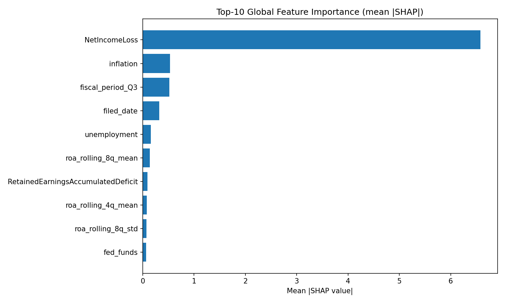
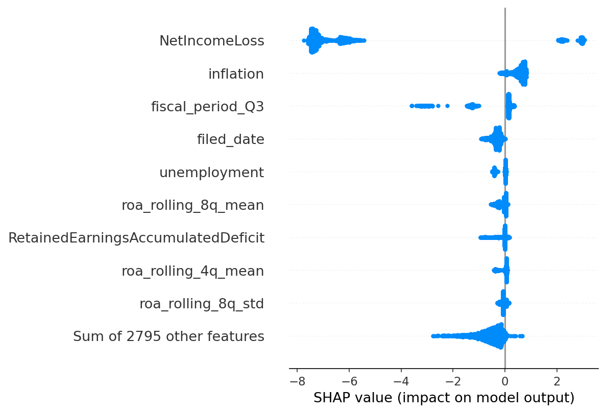

# Foresight-ML: Corporate Financial Distress Early-Warning System

End-to-end MLOps + deployed product for predicting corporate financial distress 6–12 months in advance, using SEC EDGAR filings and FRED macroeconomic indicators.

**Production endpoints (Cloud Run):**

- Inference API — `https://foresight-api-<hash>-uc.a.run.app`
- Dashboard — `https://foresight-dashboard-<hash>-uc.a.run.app`
- MLflow — `https://foresight-mlflow-6ool3rlbea-uc.a.run.app`

---

## Table of Contents

- [Project Overview](#project-overview)
- [Architecture](#architecture)
- [Data Sources](#data-sources)
- [Data Ingestion](#data-ingestion)
- [Data Preprocessing](#data-preprocessing)
- [Feature Engineering & Bias Analysis](#feature-engineering--bias-analysis)
- [Distress Labeling](#distress-labeling)
- [Model Development](#model-development)
- [Airflow DAG Orchestration](#airflow-dag-orchestration)
- [Model Serving API](#model-serving-api)
- [Streamlit Dashboard](#streamlit-dashboard)
- [Drift Monitoring & Automated Retraining](#drift-monitoring--automated-retraining)
- [Model Versioning & Inference Manifest](#model-versioning--inference-manifest)
- [CI/CD Pipeline](#cicd-pipeline)
- [Observability & Structured Logging](#observability--structured-logging)
- [DVC Data Versioning](#dvc-data-versioning)
- [MLflow Experiment Tracking](#mlflow-experiment-tracking)
- [Model Experiments Notebook](#model-experiments-notebook)
- [Validation & Anomaly Detection](#validation--anomaly-detection)
- [Bias Detection & Mitigation](#bias-detection--mitigation)
- [Infrastructure](#infrastructure)
- [Project Structure](#project-structure)
- [Deployment — Fresh Environment Replication](#deployment--fresh-environment-replication)
- [Local Setup & Quickstart](#local-setup--quickstart)
- [Running the Pipelines](#running-the-pipelines)
- [Testing](#testing)
- [Outputs & Artifacts](#outputs--artifacts)
- [Tech Stack](#tech-stack)

---

## Project Overview

Foresight-ML predicts corporate financial distress using machine learning applied to publicly available financial and macroeconomic data. The system generates quarterly risk scores per company, providing 6–12 month early warning signals before distress events occur.

The project is structured as a full MLOps system covering:

- Automated incremental data ingestion from SEC EDGAR and FRED APIs
- BigQuery-based cleaning and feature engineering
- Supervised model training (XGBoost + Optuna hyperparameter tuning)
- MLflow experiment tracking and model registry
- Airflow-orchestrated pipelines for data, training, **drift monitoring, and automated retraining**
- **FastAPI inference service + Streamlit dashboard, both deployed on Cloud Run**
- CI/CD automation via GitHub Actions with container scanning (Trivy), quality gates (SonarCloud), and Slack notifications
- DVC artifact versioning backed by GCS
- **Structured JSON logging + Cloud Monitoring alerts on drift, ROC-AUC regression, and job failure**

---

## Architecture

```
┌─────────────────────────────────────────────────────────────┐
│              DATA PIPELINE (foresight_ingestion DAG)        │
│              Schedule: @daily                               │
└──────────────────┬──────────────────────────────────────────┘
                   │
       ┌───────────┴───────────┐
       ▼                       ▼
┌─────────────┐         ┌─────────────┐
│ FRED        │         │ SEC XBRL    │
│ Ingestion   │         │ Ingestion   │
│ (incremental│         │ (incremental│
│  revision-  │         │  amendment- │
│  safe)      │         │  safe)      │
└──────┬──────┘         └──────┬──────┘
       └──────────┬────────────┘
                  ▼
         ┌────────────────┐
         │ GCS Raw Zone   │
         │ raw/fred/*     │
         │ raw/sec_xbrl/* │
         └───────┬────────┘
                 ▼
         ┌────────────────┐
         │ BigQuery Clean │
         │ SQL transform  │
         │ final_v2 table │
         └───────┬────────┘
                 ▼
         ┌────────────────┐
         │ Panel Build +  │
         │ Distress Label │
         └───────┬────────┘
                 ▼
         ┌────────────────┐
         │ Feature Eng +  │
         │ Bias Analysis  │
         └───────┬────────┘
                 ▼
         ┌────────────────┐
         │ Validation +   │
         │ Anomaly Detect │
         └───────┬────────┘
                 ▼
         ┌────────────────┐
         │ Drift Monitor  │  ◄── Evidently AI (DataDrift + DataQuality)
         │ (writes flag   │
         │  to GCS)       │
         └───────┬────────┘
                 ▼
         ┌────────────────────┐
         │ check_retrain_flag │  ◄── BranchPythonOperator
         └───┬────────────┬───┘
             │            │
     (drift) ▼            ▼ (no drift)
  TriggerDagRun      skip_retraining
  foresight_training

┌─────────────────────────────────────────────────────────────┐
│             MODEL PIPELINE (foresight_training DAG)         │
│             Schedule: @weekly + drift-triggered             │
└──────────────────┬──────────────────────────────────────────┘
                   ▼
         ┌────────────────┐
         │ Data Gate      │
         └───────┬────────┘
                 ▼
         ┌────────────────┐
         │ Train + Tune   │
         │ (XGBoost +     │
         │  Optuna 25     │
         │  trials)       │
         └───────┬────────┘
                 ▼
         ┌────────────────┐
         │ Evaluate +     │
         │ Quality Gate   │
         │ ROC-AUC ≥ 0.80 │
         └───────┬────────┘
                 ▼
         ┌────────────────┐
         │ SHAP +         │
         │ Bias Report    │
         └───────┬────────┘
                 ▼
         ┌────────────────┐
         │ Batch Inference│
         │ + SHAP attach  │
         │ + manifest.json│
         └───────┬────────┘
                 ▼
         ┌────────────────┐
         │ MLflow Model   │
         │ Registry +     │
         │ Rollback Check │
         └────────────────┘

┌─────────────────────────────────────────────────────────────┐
│  SERVING LAYER  (Cloud Run, auto-deployed via GitHub Actions)│
├──────────────────────────┬──────────────────────────────────┤
│  foresight-api           │  foresight-dashboard             │
│  (FastAPI + uvicorn)     │  (Streamlit multi-page)          │
│  /predict /company/{cik} │  • Company Risk Explorer         │
│  /alerts /health         │  • High-Risk Watchlist           │
│  /model/info             │  • Model Health                  │
│  /drift/status           │  • Pipeline Status               │
└──────────┬───────────────┴───────────────┬──────────────────┘
           │  reads GCS + MLflow Registry  │  reads API + GCS
           ▼                               ▼
┌─────────────────────────────────────────────────────────────┐
│  OBSERVABILITY                                              │
│  • Structured JSON logs → Cloud Logging                     │
│  • Cloud Monitoring alert policies → email + Slack          │
│      - Cloud Run job failure                                │
│      - test_roc_auc < 0.85                                  │
│      - Data drift detected                                  │
└─────────────────────────────────────────────────────────────┘
```

**CI/CD Responsibility Split:**

- `ci.yml` — lint, type, security, coverage, SonarCloud scan on every PR
- `cd-dev.yml` — builds and deploys ingestion Docker image to Cloud Run on ingestion code changes
- `model_training.yml` — builds and deploys training Docker image to Cloud Run on model code changes
- `cd-api.yml` — builds and deploys the FastAPI service to Cloud Run on `src/api/**` changes
- `cd-dashboard.yml` — builds and deploys the Streamlit dashboard to Cloud Run on `src/dashboard/**` changes
- All CD workflows run Trivy on the built image and post Slack notifications on success/failure

---

## Data Sources

| Source                 | Type               | Content                                                   | Access                                  |
| ---------------------- | ------------------ | --------------------------------------------------------- | --------------------------------------- |
| SEC EDGAR XBRL API     | Quarterly / Annual | Income statements, balance sheets, cash flows (10-Q/10-K) | Public API — requires User-Agent header |
| FRED (Federal Reserve) | Monthly / Weekly   | Federal Funds Rate, CPI, credit spreads, unemployment     | Public API — requires free API key      |

All data is corporate-level and public. No PII is collected or stored.

---

## Data Ingestion

### SEC XBRL Ingestion (`src/ingestion/sec_xbrl_increment_job.py`)

Fetches quarterly XBRL financial statement data for companies in the configured universe.

**Company universe:** Loaded from `reference/companies.csv` in GCS. This file defines which companies are ingested.

> **Demo mode:** The current pipeline processes `companies_df.head(5)` — the first 5 companies from the reference file. This is an intentional runtime guardrail for submission and development. To process the full company universe, remove the `head(5)` line in `sec_xbrl_increment_job.py`.

**Incremental strategy (amendment-safe):**

1. For each company, fetch the full XBRL extract from SEC EDGAR
2. Identify the most recent 8 quarters in existing stored data
3. Drop those 8 quarters from the stored data (to capture any amendments)
4. Re-fetch and merge from the latest API response
5. Deduplicate on `(cik, fiscal_year, fiscal_period, tag)` keeping the latest

The 8-quarter refresh window covers the typical SEC amendment cycle without requiring a full reload on every run.

**Storage:** One Parquet file per company at `raw/sec_xbrl/cik=<CIK>/data.parquet`

**Normalization applied:**

- CIK zero-padded to 10 digits for consistent joining
- Only quarterly periods (Q1–Q4) retained; annual FY tags filtered out
- `quarter_key` composite field created (e.g., `2023_Q3`) as merge key

### FRED Ingestion (`src/ingestion/fred_increment_job.py`)

Fetches macroeconomic indicator time series from the FRED API.

**Indicators fetched:** Federal Funds Rate, CPI, credit spreads, unemployment, and GDP growth proxies.

**Incremental strategy (revision-safe):**

1. Fetch full time series from FRED API at native frequency
2. Normalize to quarterly by converting to quarter-end date and taking the last value per quarter
3. Drop the most recent 8 quarters from existing stored data (FRED regularly revises historical values)
4. Merge fresh data with older stable data
5. Deduplicate by date, keeping the latest value

**Storage:** One Parquet file per series at `raw/fred/series_id=<ID>.parquet`

**Why quarterly normalization?** All downstream features are quarterly (matching SEC filing cadence). Taking the last value per quarter provides the most current macro reading at quarter-end.

---

## Data Preprocessing

### BigQuery Cleaning (`src/data/cleaned/data_cleaned.sql`)

After ingestion, a SQL transform runs in BigQuery to produce the cleaned dataset.

**Steps in order:**

1. **Pivot SEC long → wide** (`sec_wide`): Converts XBRL long-format (one row per tag) to wide-format (one row per company-quarter) using `MAX(CASE WHEN tag=... THEN value END)`

2. **Pivot FRED timeseries → wide** (`fred_wide`): Aligns macro indicators to quarterly keys

3. **Join SEC + FRED** by `quarter_key` to produce a unified company-quarter dataset

4. **Repair accounting identity**: Uses `COALESCE` to fill missing values using the fundamental relationship `Assets = Liabilities + Equity`:

   ```sql
   fixed_Assets = COALESCE(Assets, Liabilities + StockholdersEquity)
   fixed_Liabilities = COALESCE(Liabilities, Assets - StockholdersEquity)
   fixed_Equity = COALESCE(StockholdersEquity, Assets - Liabilities)
   ```

5. **Zero-impute financial fields**: Missing financial statement fields are filled with 0 via `IFNULL(..., 0)` to produce a stable numeric matrix for downstream modeling

6. **Forward/back-fill macro columns**: Missing macro values filled using `LAST_VALUE(...IGNORE NULLS)` window functions partitioned by `cik`, ordered by `filed_date`

7. **Export to GCS**: Final table exported as Parquet to `cleaned_data/final_v2/train_*.parquet`

**Output:** BigQuery table `cleaned_foresight.final_v2` + Parquet export to GCS

### Panel Construction (`src/panel/builder.py`)

Converts the cleaned wide-format dataset into a canonical modeling panel.

- Renames SEC-specific column names to model-friendly names (`cik→firm_id`, `Assets→total_assets`, etc.)
- Validates required schema — hard fail if columns missing
- Deduplicates on `(firm_id, date)` — one row per company per quarter
- Sorts by `(firm_id, date)` to guarantee time-ordered operations
- Flags missing quarters (day gap > 120 days) with a warning log
- Creates lag features: `lag1` (previous quarter) and `lag4` (same quarter last year) for `total_assets`, `total_liabilities`, `net_income`

**Output:** `features/panel_v1/panel.parquet`

### Data Splitting (`src/data/split.py`)

Strict time-based splits to prevent data leakage:

| Split      | Period    | Purpose                      |
| ---------- | --------- | ---------------------------- |
| Training   | 2010–2019 | Model training (~60%)        |
| Validation | 2020–2021 | Hyperparameter tuning (~20%) |
| Test       | 2022–2023 | Final evaluation (~20%)      |

- Stratified by `company_size_bucket` and `sector_proxy`
- SMOTE oversampling applied to training split **only**, after splitting (never before — prevents leakage)
- Scaler fitted on training data only, serialized to GCS for inference-time use
- Class weights computed for XGBoost `scale_pos_weight`

**Outputs:** `splits/v1/train.parquet`, `val.parquet`, `test.parquet`, `scaler_pipeline.pkl`, `scale_pos_weight.json`

---

## Feature Engineering & Bias Analysis

### Feature Engineering (`src/feature_engineering/pipelines/feature_engineering.py`)

Runs in BigQuery mode via the Airflow DAG as a subprocess call.

Features computed:

- Core financial ratios: Current Ratio, Debt-to-Equity, Interest Coverage, Net Margin, ROA, Operating Cash Flow to Total Debt
- Temporal features: quarter-over-quarter growth rates for revenue and cash flow, rolling 4-quarter slopes
- Volatility features: rolling standard deviation of net income and cash flow over 4 quarters
- Distress indicator features: consecutive quarters of negative cash flow, debt acceleration rate
- Composite signals: `altman_z_approx`, `cash_burn_rate`, interaction terms
- Outlier clipping at ±5σ; `inf` replaced with NaN
- `safe_divide` used throughout to return NaN on zero denominator (avoids inf/explosion)

**Output:** BigQuery table `financial_distress_features.cleaned_engineered_features`

### Bias Analysis (`src/feature_engineering/pipelines/bias_analysis.py`)

Evaluates feature distributions across meaningful data slices to detect and document bias **before modeling**.

**Slices analyzed:**

- Company size bucket (small / mid / large)
- Sector proxy
- Time period (pre-2016 / post-2016)
- Macro regime (high / low Federal Funds Rate)
- Distress label group

**Metrics used:**

- PSI (Population Stability Index) — drift alert triggered when PSI > 0.25
- JS divergence

**Output:** Bias report saved to GCS + `src/feature_engineering/data/bias_report.md`

---

## Distress Labeling (`src/labeling/distress.py`)

Labels are derived entirely from accounting data — no external bankruptcy database required.

**Label definition:** A firm is labeled distressed if it has **two consecutive quarters of negative net income**.

```python
neg_income = net_income < 0
two_consecutive_losses = rolling(2).sum() == 2  # per firm, sorted by date
distress_label(t) = two_consecutive_losses(t + horizon)  # shift(-horizon)
```

**Why two consecutive quarters?** A single loss quarter is common and noisy. Two consecutive quarters is a more reliable signal of deteriorating financial health.

**Prediction horizon:** Configurable via `settings.prediction_horizon` (default: 2 quarters). The label at time `t` represents distress status at `t + horizon`, making this a forward-looking prediction target.

**Leakage safety:** Features at time `t` use `shift(+1)` and `shift(+4)` (backward-looking). The label uses `shift(-horizon)` (forward-looking). These never mix.

**Expected class distribution:** 2–5% positive rate, reflecting the rarity of financial distress events.

**Output:** `features/labeled_v1/labeled_panel.parquet`

---

## Model Development

### Training (`src/models/train.py`)

- Loads train/val/test splits from GCS (`splits/v1/`)
- Trains XGBoost baseline with class-weighted loss using serialized `scale_pos_weight`
- Runs Optuna hyperparameter tuning (25 trials) over validation ROC-AUC using Bayesian optimization
- Retrains best model on full train+val split with best params
- Saves model artifact + scaler to GCS

**Hyperparameter search space** (`configs/model/xgboost.yaml`):

| Hyperparameter     | Search Values        | Description                  |
| ------------------ | -------------------- | ---------------------------- |
| `learning_rate`    | 0.01, 0.05, 0.1, 0.2 | Step size shrinkage          |
| `max_depth`        | 3, 4, 6, 8           | Maximum tree depth           |
| `n_estimators`     | 100, 200, 400, 800   | Number of boosting rounds    |
| `subsample`        | 0.6, 0.8, 1.0        | Row subsampling ratio        |
| `colsample_bytree` | 0.6, 0.8, 1.0        | Feature subsampling per tree |
| `min_child_weight` | 1, 5, 10             | Minimum child node weight    |

Every Optuna trial is logged to MLflow with its hyperparameters, validation ROC-AUC, and training time. The best trial is identified by maximum validation ROC-AUC.

**Model selection rationale:** After tuning, the model is retrained on the combined train+val split using the best hyperparameters, then evaluated once on the held-out test set. This prevents test set leakage during hyperparameter selection.

**Final Best Hyperparameters Found by Optuna**

After 25 Optuna trials, the best-performing configuration was:

| Hyperparameter     |            Best Value |
| ------------------ | --------------------: |
| `learning_rate`    | `0.01840423513419366` |
| `max_depth`        |                   `3` |
| `n_estimators`     |                 `400` |
| `subsample`        |                 `0.6` |
| `colsample_bytree` |                 `1.0` |
| `min_child_weight` |                  `10` |

**Performance Summary**

- **Baseline validation ROC-AUC:** `0.975640742671591`
- **Final test ROC-AUC after tuning and retraining:** `0.9768994970855862`


| Model | Val ROC-AUC | Test ROC-AUC |
|-------|-------------|--------------|
| XGBoost baseline (default params) | 0.9756 | — |
| XGBoost tuned (Optuna 25 trials) | 0.9756 | 0.9769 |

> Validation ROC-AUC was already high at baseline due to strong feature signal (NetIncomeLoss dominates).
> Optuna tuning confirmed the configuration and improved generalization on the unseen test set (0.9769).

**Sensitivity Summary**

- The Optuna sensitivity analysis indicated that validation ROC-AUC was most affected by `n_estimators`, `max_depth`, and `subsample`.
- Performance peaked around `n_estimators = 200–400`, while `800` estimators generally underperformed relative to the best trials.
- Shallower trees (`max_depth = 3`) consistently produced the strongest validation ROC-AUC, while deeper trees showed more performance drop-off.
- Lower subsampling (`subsample = 0.6`) aligned with the best-performing trial, whereas higher values produced more mixed results across runs.

**Convergence Notes**

- Optuna converged toward a stable high-performing region within the 25-trial search budget, without large late-stage jumps.
- The final configuration favored conservative boosting, shallow trees, and stronger regularization through a higher `min_child_weight`.
- After hyperparameter selection, the model was retrained on the combined train + validation split and evaluated once on the hold-out test set to avoid test-set leakage during model selection.

### Evaluation (`src/models/evaluate.py`)

`evaluate.py` runs held-out evaluation on 2022–2023 data and logs all outputs to MLflow.

**How it resolves artifacts:**

- Loads model artifact from `MODEL_ARTIFACT_URI` (or passed `model_uri`) and supports GCS (`gs://...`) and local paths
- Loads validation/test splits from `VAL_URI` and `TEST_URI`
- Tunes threshold on validation set by maximizing F1, then evaluates on held-out test set

**Metrics logged to MLflow:**

| Metric                       | Value            | Description                                                         |
| ---------------------------- | ---------------- | ------------------------------------------------------------------- |
| `test_roc_auc`               | **0.98**         | Primary metric — ability to rank distressed vs healthy firms        |
| `test_recall_at_5pct`        | **0.74**         | Of all firms that distressed, how many were in top-risk predictions |
| `test_precision_at_5pct`     | logged in MLflow | Of top-risk predictions, how many actually distressed               |
| `test_brier_score`           | logged in MLflow | Calibration of probability estimates                                |
| `test_f1_at_tuned_threshold` | logged in MLflow | Threshold tuned by maximizing F1 on validation set                  |

> **Note on F1:** F1 at tuned threshold appears low due to extreme class imbalance (2–5% distress rate). ROC-AUC and Recall@K are the appropriate primary metrics — they are robust to class imbalance and directly measure the ability to identify at-risk companies.

**Artifacts logged to MLflow:**

- ROC curve (`evaluation_plots/roc_curve.png`)
- Precision-Recall curve (`evaluation_plots/precision_recall_curve.png`)
- Confusion matrix (`evaluation_plots/confusion_matrix.png`)
- Per-slice metrics table (`slice_metrics/slice_performance.csv` and `.json`)
- Evaluation summary (`evaluation/evaluation_summary.json`)

Per-slice evaluation reuses `bias_analysis.py` slices (company size, sector proxy, time period, macro regime) and logs a full slice-performance table.

Local command:

```bash
source .env
python -m src.models.evaluate
```

### Full Training Pipeline (`src/main_train.py`)

The training entrypoint orchestrates 6 sequential steps:

| Step | Module        | Fatal?     | Description                                      |
| ---- | ------------- | -----------| ------------------------------------------------ |
| 1    | `train.py`    |  Yes       | XGBoost training + Optuna 25-trial tuning        |
| 2    | `evaluate.py` |  Yes       | Held-out test evaluation + per-slice metrics     |
| 3    | Quality Gate  |  Yes       | Blocks if `test_roc_auc < 0.80` — exits non-zero |
| 4    | `explain.py`  |  Non-fatal | SHAP values + bias report generation             |
| 5    | `predict.py`  |  Non-fatal | Batch scoring + SHAP + manifest.json write       |
| 6    | `registry.py` |  Yes       | MLflow registry + rollback check + alert write   |

Steps 4 and 5 are non-fatal — failures log a warning but do not block model registration. Steps 1, 2, 3, and 6 are fatal — any failure exits with code 1, causing the Cloud Run job to fail.

**Quality gate:** If `test_roc_auc < 0.80` → exits with code 1 → Cloud Run job fails → Airflow `model_quality_gate` task fails → pipeline stops.

### SHAP Explainability (`src/models/explain.py`)

- SHAP TreeExplainer values computed on test set (33,636 samples × 2,804 features)
- Artifacts generated and logged to MLflow:
  - Global feature importance bar plot (mean |SHAP|)
  - Beeswarm plot
  - Top-20 feature summary table (CSV)
- SHAP values saved to `gs://financial-distress-data/shap/shap_values.parquet`
- Per-row `top_features_json` (top-3 SHAP contributors + values) attached to scored output
- `get_top_features(cik, quarter)` helper used by the FastAPI `/predict` endpoint to return per-request SHAP contributors
- Model-level bias report generated combining feature-level PSI/drift analysis with per-slice model fairness metrics

**Top 10 Features by Mean |SHAP| Value** (from real pipeline run on 33,636 test samples):

| Rank | Feature                            | Mean  | SHAP           |                                                                              | Direction | Interpretation |
| ---- | ---------------------------------- | ----- | -------------- | ---------------------------------------------------------------------------- | --------- | -------------- |
| 1    | NetIncomeLoss                      | 6.582 | Protective     | Dominant driver — higher net income strongly reduces predicted distress risk |
| 2    | inflation                          | 0.534 | Increases risk | Rising inflation raises distress probability across firms                    |
| 3    | fiscal_period_Q3                   | 0.516 | Protective     | Seasonal effect — Q3 filings associated with lower predicted risk            |
| 4    | filed_date                         | 0.324 | Protective     | More recent filings tend toward lower risk (survivorship)                    |
| 5    | unemployment                       | 0.159 | Protective     | Counter-intuitive — likely captures government stimulus periods              |
| 6    | roa_rolling_8q_mean                | 0.141 | Protective     | Sustained profitability over 8 quarters reduces distress risk                |
| 7    | RetainedEarningsAccumulatedDeficit | 0.090 | Protective     | Higher retained earnings signal financial resilience                         |
| 8    | roa_rolling_4q_mean                | 0.082 | Increases risk | Short-term ROA volatility can signal emerging trouble                        |
| 9    | roa_rolling_8q_std                 | 0.073 | Protective     | Stable long-term ROA reduces risk                                            |
| 10   | fed_funds                          | 0.069 | Protective     | Lower interest rates associated with reduced distress                        |

NetIncomeLoss dominates with a mean |SHAP| of 6.58 — roughly 12× larger than the next feature — confirming that profitability is by far the strongest predictor of financial distress. Macroeconomic features (inflation, unemployment, fed_funds) collectively rank in the top 10, validating the inclusion of FRED data alongside SEC filings.





### Batch Inference (`src/models/predict.py`)

- Loads Production model from MLflow registry (`models:/foresight_xgboost/Production`)
- Loads latest features from GCS
- Generates distress probability scores (0–1) per company per quarter
- Attaches precomputed SHAP `top_features_json` from `explain.py` output to each scored row
- Adds confidence intervals: `±0.05` margin clipped to [0, 1]
- Attaches versioning columns to every row: `model_version`, `mlflow_run_id`, `trained_at`, `scored_at`, `model_roc_auc`
- Writes `scores.parquet` + sibling `manifest.json` to GCS: `inference/scores_v{version}/`

### Model Registry (`src/models/registry.py`)

- Registers model in MLflow Model Registry after quality gate passes (ROC-AUC ≥ 0.80, no critically low slice recall)
- Transitions to **Staging** immediately on registration
- **Rollback check:** Queries current Production model ROC-AUC from MLflow, compares with new model
  - If new model is better or within 2% tolerance → promotes to **Production**
  - If new model is significantly worse → stays in Staging, writes `monitoring/alerts/rollback_triggered.json` to GCS (with both models' versions + metrics), emits a structured ERROR log, and posts Slack notification
- Pushes versioned artifacts to GCS at `models/v{version}/xgb_model.pkl` and `models/v{version}/scaler_pipeline.pkl`
- Current registered model: `foresight_xgboost` — latest version in Production

### Model Registry and Batch Inference
The final trained XGBoost model is versioned and tracked via MLflow. Before promotion, the automated registry pipeline verifies that the new model exceeds the static baseline (ROC-AUC > 0.80) and performs a rollback check to ensure its performance does not degrade by more than 2% compared to the existing Production model.

* **Current Production Version:** Version 1
* **Evaluation Metric (Test ROC-AUC):** 0.9757
* **GCS Versioned Artifact Path:** `gs://financial-distress-data/models/v1.0/`
* **Batch Inference Output Path:** `gs://financial-distress-data/inference/scores_v1.0/scores.parquet`
* **Inference Manifest:** `gs://financial-distress-data/inference/scores_v1.0/manifest.json`

---

## Airflow DAG Orchestration

### Data Pipeline DAG: `foresight_ingestion`

**File:** `src/airflow/dags/foresight_ml_data_pipeline.py`
**Schedule:** `@daily`
**Max active runs:** 3

| Task                           | Description                                                  |
| ------------------------------ | ------------------------------------------------------------ |
| `run_fred_ingestion`           | Incremental FRED macro data fetch                            |
| `run_sec_ingestion`            | Incremental SEC XBRL filing fetch (5 companies in demo mode) |
| `run_preprocess_ingested_data` | Sanity gate — confirms raw data exists in GCS                |
| `run_bigquery_cleaning`        | Runs `data_cleaned.sql` in BigQuery                          |
| `run_panel_build`              | Constructs canonical panel dataset                           |
| `run_labeling`                 | Applies distress label with forward horizon                  |
| `run_feature_bias_pipeline`    | Feature engineering + bias analysis in BQ mode               |
| `run_validation_anomaly`       | Schema checks, null rates, IQR anomaly detection             |
| `run_drift_monitoring`         | Evidently AI drift report, writes `retrain_flag.json` on drift |
| `check_retrain_flag`           | BranchPythonOperator — reads retrain flag from GCS           |
| `trigger_training_dag`         | TriggerDagRunOperator — kicks off `foresight_training`       |
| `skip_retraining`              | EmptyOperator — terminal node when no drift is detected      |

`fred_task` and `sec_task` run in **parallel** — they are independent data sources.

**Feature/Bias runtime mode:**

- `FEATURE_BIAS_MODE=safe` (default): skips heavy visualizations — recommended for demos
- `FEATURE_BIAS_MODE=full`: full visualization workload

### Data Pipeline Gantt Chart


> Bottleneck identified: `run_feature_bias_pipeline` (longest task). Optimized by adding `FEATURE_BIAS_MODE=safe` default to skip heavy visualizations during standard runs.

---

### Training Pipeline DAG: `foresight_training`

**File:** `src/airflow/dags/foresight_ml_training_pipeline.py`
**Schedule:** `@weekly` + drift-triggered via `TriggerDagRunOperator` from the data DAG
**Max active runs:** 1

| Task                 | Description                                                              |
| -------------------- | ------------------------------------------------------------------------ |
| `check_data_ready`   | Gate — confirms labeled panel exists in GCS before triggering training   |
| `run_model_training` | Triggers `foresight-training` Cloud Run job — runs all 6 pipeline steps  |
| `model_quality_gate` | Reads `optuna_results.json` from GCS, fails DAG if `test_roc_auc < 0.80` |


> **Note on scheduling:** The DAGs are configured with `@daily` (data) and `@weekly` (training) schedules. For production deployment, the Airflow instance would be migrated to Cloud Composer or Cloud Scheduler would trigger Cloud Run jobs directly on the same cadence. For this submission, Airflow runs locally and pipelines are triggered manually (or drift-triggered via the branch in the data DAG).

---

## Model Serving API

The trained model is served as a low-latency HTTPS API on **Cloud Run** (`foresight-api`).

### Endpoints

| Method | Path | Purpose |
|--------|------|---------|
| POST   | `/predict`            | Score a company-quarter — returns distress probability, risk level, SHAP top-3 features, confidence interval, model version |
| GET    | `/company/{cik}`      | Full historical risk trajectory for a CIK from `scores.parquet` |
| GET    | `/alerts?threshold=X` | All companies scoring above `threshold` in the latest batch (default 0.7) |
| GET    | `/health`             | Liveness probe — always returns 200 once the app is warm |
| GET    | `/model/info`         | Current production model version, ROC-AUC, training timestamp (from `manifest.json`) |
| GET    | `/drift/status`       | Latest drift summary (dataset_drift, PSI per feature, Evidently report link) |

### Code layout (`src/api/`)

- `main.py` — FastAPI app with `lifespan` context manager (model + scaler loaded once from GCS on startup), CORS configured for the dashboard origin, router registration
- `schemas.py` — Pydantic request/response models (`PredictRequest`, `PredictResponse`, `AlertItem`, `AlertsResponse`, `ModelInfoResponse`, `DriftStatusResponse`)
- `dependencies.py` — API key authentication via the `X-API-Key` header (keys stored in GCP Secret Manager, rotated without redeploy) + `slowapi` rate limiting (100 req/min on `/predict`; `/health` exempt)
- `routers/predict.py` — applies scaler → `model.predict_proba()` → `get_top_features()` → assembles response
- `routers/company.py` — historical scores from `scores.parquet`
- `routers/alerts.py` — filters scores above threshold
- `routers/health.py` — liveness + `/model/info` (reads `manifest.json` from GCS)
- `routers/drift.py` — reads `monitoring/drift_reports/summary_latest.json`

### Example request

```bash
curl -X POST "$FORESIGHT_API_URL/predict" \
  -H "X-API-Key: $API_KEY" \
  -H "Content-Type: application/json" \
  -d '{"cik": "0000320193", "quarter": "2023_Q4"}'
```

Returns:

```json
{
  "cik": "0000320193",
  "distress_probability": 0.034,
  "risk_level": "low",
  "confidence_interval": [0.0, 0.084],
  "top_features": [
    {"feature": "NetIncomeLoss", "shap_value": -0.42},
    {"feature": "roa_rolling_8q_mean", "shap_value": -0.18},
    {"feature": "inflation", "shap_value":  0.07}
  ],
  "model_version": "v1",
  "scored_at": "2026-04-19T06:00:00Z"
}
```

### Auto-deployment (`.github/workflows/cd-api.yml`)

Triggers on any push to `main` that touches `src/api/**`, `src/models/**`, or `deployment/docker/Dockerfile.api`:

1. Build image → push to Artifact Registry (`foresight/foresight-api:sha`)
2. Trivy vulnerability scan — HIGH/CRITICAL fails the build
3. `gcloud run deploy foresight-api` (Workload Identity Federation auth, no static keys)
4. Slack notification on success/failure

### Unit + integration test coverage

- `tests/test_api/test_predict.py`, `test_alerts.py`, `test_health.py`, `test_logic.py` — unit tests with mocked GCS + MLflow
- `tests/integration/test_api_e2e.py` — FastAPI `TestClient` across all 6 endpoints

---

## Streamlit Dashboard

`foresight-dashboard` (Cloud Run) is a multi-page Streamlit app aimed at credit analysts and risk managers.

### Pages (`src/dashboard/pages/`)

| File | Page | Contents |
|------|------|----------|
| `company_risk.py`    | Company Risk Explorer | CIK/company search, distress probability trend chart (Plotly), SHAP waterfall (top-5 contributors), financial snapshot table, risk badge, "Score now" button |
| `watchlist.py`       | High-Risk Watchlist   | Threshold slider, sector + size filters, sortable table (company, CIK, sector, size, risk score, trend ↑/↓, active signals), CSV export, per-row "View" button |
| `model_health.py`    | Model Health          | Production model card (version, ROC-AUC, Recall@5%, trained date, MLflow link), drift status card (dataset_drift, PSI table, Evidently report link), drift alert banner, slice performance table |
| `pipeline_status.py` | Pipeline Status       | Data pipeline + training pipeline task lists with name / duration / status dot, summary metric cards, last DAG run time, latest GCS artifact timestamps |

### Data loaders (`src/dashboard/data/`)

- `gcs_loader.py` — `load_scores()`, `load_manifest()`, `load_drift_summary()`, `load_validation_report()`. All wrapped in `@st.cache_data(ttl=300)` for a 5-minute TTL.
- `api_client.py` — `predict(cik)`, `get_alerts(threshold)`, `get_model_info()`, `get_drift_status()`

### Helpers (`src/dashboard/utils.py`)

`risk_badge(score)` returns a colored badge (🟢/🟡/🔴), plus Plotly chart theme and color helpers shared across pages.

### Auto-deployment (`.github/workflows/cd-dashboard.yml`)

Same pattern as the API — build, Trivy scan, deploy to `foresight-dashboard` Cloud Run service, Slack notify.

### Test coverage

`tests/test_dashboard.py` covers the GCS loader and API client logic (mocked).

---

## Drift Monitoring & Automated Retraining

The deployed model is continuously monitored for data drift and performance decay. When drift is detected, the retraining pipeline is triggered automatically.

### Drift Monitor (`src/monitoring/drift_monitor.py`)

- **Reference dataset:** `splits/v1/train.parquet` — the exact data the current Production model was trained on
- **Current dataset:** latest `features/labeled_v1/labeled_panel.parquet`
- **Tool:** [Evidently AI](https://www.evidentlyai.com/) — `DataDriftPreset` + `DataQualityPreset`
- **Outputs to GCS:**
  - `monitoring/drift_reports/report_<timestamp>.html` — full Evidently HTML report (linked from the Model Health dashboard page)
  - `monitoring/drift_reports/summary_latest.json` — machine-readable summary (`dataset_drift`, `share_of_drifted_columns`, per-feature PSI)
  - `monitoring/retrain_flag.json` — written **only if** drift is detected above threshold

### Retrain Trigger (`src/monitoring/retrain_trigger.py`)

Reads `retrain_flag.json` from GCS, deletes it after reading (idempotent), returns `True`/`False`. This is the single source of truth for the Airflow branching logic.

### Airflow Wiring (`src/airflow/dags/foresight_ml_data_pipeline.py`)

```
run_validation_anomaly
    └── run_drift_monitoring          (PythonOperator)
            └── check_retrain_flag    (BranchPythonOperator)
                    ├── trigger_training_dag  (TriggerDagRunOperator → foresight_training)
                    └── skip_retraining       (EmptyOperator)
```

If drift fires, the training DAG reruns end-to-end: pull latest data → retrain → evaluate → quality gate → rollback check → register new model → redeploy via `model_training.yml`. If the new model fails the quality gate or the rollback check, the existing Production model is retained unchanged and a rollback alert is emitted.

### Retraining thresholds

| Signal | Threshold | Action |
|--------|-----------|--------|
| Dataset drift share | `share_of_drifted_columns > 0.3` | Write retrain flag |
| Single-feature PSI | `psi > 0.25` on any critical feature (NetIncomeLoss, roa_*, DebtToEquity) | Write retrain flag |
| Slice ROC-AUC drop | `> 10pp` below overall in any demographic slice | Write retrain flag |
| Test ROC-AUC regression | `< 0.85` on new model | Block promotion + email alert |

### Cloud Monitoring alerts (Terraform: `infra/monitoring.tf`)

| Alert | Channel | Condition |
|-------|---------|-----------|
| Cloud Run job failure | email + Slack | Any Cloud Run job exits non-zero |
| Model quality regression | email | `test_roc_auc < 0.85` on new training run |
| Data drift detected | Slack | `dataset_drift = true` in latest drift summary |

### Integration test coverage

`tests/integration/test_drift_monitor.py` — runs Evidently on a fabricated dataframe and asserts the output JSON schema.

---

## Model Versioning & Inference Manifest

Every batch inference run is fully auditable. Two mechanisms together guarantee reproducibility: per-row versioning columns and a sidecar manifest.

### Per-row versioning columns in `scores.parquet`

`src/models/predict.py` attaches five columns to every scored row before writing:

- `model_version` — semantic version (e.g. `v1.0`)
- `mlflow_run_id` — exact MLflow run that produced the model
- `trained_at` — UTC timestamp when the model was trained
- `scored_at` — UTC timestamp of this inference batch
- `model_roc_auc` — held-out test ROC-AUC at training time

### `manifest.json` (written by `src/models/manifest_io.py`)

Schema defined in `src/models/manifest_schema.py`:

```json
{
  "model_version": "v1",
  "mlflow_run_id": "a1b2c3d4e5f6...",
  "trained_at": "2026-03-15T10:00:00Z",
  "scored_at":  "2026-03-30T06:00:00Z",
  "row_count":  48291,
  "roc_auc":    0.9769,
  "gcs_scores_path": "gs://financial-distress-data/inference/scores_v1.0/scores.parquet"
}
```

Written alongside `scores.parquet` in the same GCS prefix after each batch inference run. Consumed by the API's `/model/info` endpoint and the dashboard's Model Health page.

### Rollback alerting (`src/models/registry.py`)

On a failed rollback check (new model worse than production by more than 2%), the registry:

1. Writes `monitoring/alerts/rollback_triggered.json` to GCS with both candidate and incumbent model versions + metrics
2. Emits a structured ERROR log (picked up by Cloud Monitoring log-based metric)
3. Posts a Slack notification via the Cloud Run Slack adapter
4. Leaves the existing Production model unchanged

### Test coverage

- `tests/test_manifest.py` — manifest schema + round-trip
- `tests/test_inference_schema.py` — versioning columns present on every row
- `tests/test_registry.py` — rollback alert JSON written with expected fields

---

## CI/CD Pipeline

### Continuous Integration (`.github/workflows/ci.yml`)

Runs on every pull request to `main`:

- Ruff lint + format check
- mypy type checking
- Bandit security scan
- pip-audit dependency vulnerability scan
- pytest with 45% coverage gate (`--cov-report=xml` for SonarCloud)
- **SonarCloud** scan using `sonar-project.properties` — quality gate blocks merge on failure
- DVC remote config validation

### Continuous Deployment workflows

| Workflow | Trigger path | Deploys to |
|----------|--------------|------------|
| `cd-dev.yml`         | `src/ingestion/**`, `deployment/docker/Dockerfile.ingestion` | `fred-ingestion` + `sec-ingestion` Cloud Run jobs |
| `model_training.yml` | `src/models/**`, `configs/model/**`, `deployment/docker/Dockerfile.train` | `foresight-training` Cloud Run job |
| `cd-api.yml`         | `src/api/**`, `src/models/**`, `deployment/docker/Dockerfile.api` | `foresight-api` Cloud Run service |
| `cd-dashboard.yml`   | `src/dashboard/**`, `deployment/docker/Dockerfile.dashboard` | `foresight-dashboard` Cloud Run service |

Every CD workflow performs the same pipeline:

```
Checkout → uv install → Build image → Trivy scan (fail on HIGH/CRITICAL)
  → Push to Artifact Registry → gcloud run deploy
  → Slack webhook notification (success + failure)
```

**Auth:** GitHub OIDC → GCP Workload Identity Federation. No static service account keys in GitHub.

### Pre-commit hooks (`.pre-commit-config.yaml`)

`ruff`, `ruff-format`, `mypy`, `bandit`, `gitleaks` (secret detection), `trailing-whitespace`, `end-of-file-fixer`, `check-yaml`, `check-ast`, `check-merge-conflict`, 500 KB file-size cap.

### Branch protection on `main`

Require PR, CI pass, 1 approval, block force push, require linear history.

### Notifications & Alerts

- **GitHub Actions email** on any pipeline failure (`model_training.yml`) — sends commit SHA, branch, direct link to the failed run
- **Slack** — all four CD workflows post to `SLACK_WEBHOOK_URL` on both success and failure, via the Cloud Run Slack adapter (`deployment/slack_adapter/`)

---

## Observability & Structured Logging

### Structured JSON logger (`src/utils/logging.py`)

All modules under `src/` use `get_logger(__name__)`, which emits JSON-formatted log records with:

- `timestamp` (UTC, ISO-8601)
- `severity`
- `message`
- `module`
- `function`
- any `extra` fields attached at the call site

These are parsed natively by Cloud Logging, so every Cloud Run service + job gets structured logs with no extra configuration.

### Log aggregation flow

```
Cloud Run service / job
    └── stdout/stderr (JSON) → Cloud Logging
            └── log-based metrics → Cloud Monitoring
                    └── alert policies → email + Slack
```

### Querying logs

```bash
# Last 20 API errors in production
gcloud logging read \
  'resource.type=cloud_run_revision
   AND resource.labels.service_name=foresight-api
   AND severity>=ERROR' \
  --limit=20 --format=json --project=financial-distress-ew

# Training job output from the last hour
gcloud logging read \
  'resource.type=cloud_run_job
   AND resource.labels.job_name=foresight-training' \
  --limit=100 --freshness=1h --format="value(textPayload)"
```

### Cloud Monitoring alert policies (`infra/monitoring.tf`)

| Policy | Trigger |
|--------|---------|
| Cloud Run job failure | any `cloud_run_job` error execution |
| Model quality regression | `test_roc_auc` metric < 0.85 |
| Data drift detected | log-based metric on `"drift_detected"` keyword from drift monitor |

Notification channels are email (primary) and a Slack webhook (via `deployment/slack_adapter/`).

---

## DVC Data Versioning

DVC tracks model artifacts and dataset splits with GCS as the remote store.

**Remote:** `gs://financial-distress-data/dvc-storage`

**Pipeline stages** (`dvc.yaml`):

```
split → train → evaluate
```

Each stage tracks its deps, params, outs, and metrics — changing `configs/model/xgboost.yaml` automatically reruns only the affected stages.

```bash
# Setup remote
make dvc-setup

# Reproduce pipeline from scratch
uv run dvc repro

# View pipeline graph
uv run dvc dag

# View tracked metrics
uv run dvc metrics show

# Push artifacts to GCS
make dvc-push

# Pull artifacts from GCS
make dvc-pull
```

---

## MLflow Experiment Tracking

**Tracking server:** Cloud Run service (`foresight-mlflow`)
**Backend store:** Cloud SQL PostgreSQL
**Artifact store:** `gs://financial-distress-data/mlflow/artifacts`
**Experiment:** `foresight-training`
**Tracking URI:** `https://foresight-mlflow-6ool3rlbea-uc.a.run.app`

Each training run logs:

- All Optuna trial hyperparameters and validation ROC-AUC
- Final test metrics (ROC-AUC, Precision@K, Recall@K, Brier Score, F1)
- Per-slice performance table
- ROC curve, PR curve, confusion matrix (PNG artifacts)
- SHAP feature importance plots

### What is tracked per MLflow run

- **Parameters:** XGBoost hyperparameters, runtime settings (`top_k_fraction`, tuned threshold, evaluation year window), data/model URIs
- **Metrics:** Validation ROC-AUC per Optuna trial, training time, all final test metrics
- **Artifacts:** Sensitivity plot, evaluation plots (ROC, PR, confusion matrix), slice-performance tables, evaluation summary JSON, SHAP plots
- **Run metadata:** Experiment name, run ID, source entrypoint, start/end time — enabling full traceability from UI to code


**Access:**

```bash
source .env
curl -I "$MLFLOW_TRACKING_URI"
# or open MLFLOW_TRACKING_URI in browser
```

---

## Model Experiments Notebook

Notebooks live in `notebooks/`:

- `model_experiments.ipynb` — loads from live MLflow tracking URI, shows Optuna trial history, final model selection rationale, sensitivity analysis plots, and a deployment-readiness section confirming production model version, GCS artifact paths, and MLflow run ID are all consistent.
- `distress_label_analysis.ipynb` — validates the distress label definition: class distribution, positive rate, and justification of the chosen threshold.
- `feature_engineering.ipynb` — feature derivation walk-through.
- `eda.ipynb` — exploratory data analysis.

### Important: avoid local fallback confusion

If plots show a **single dot**, the notebook likely loaded a one-row local CSV fallback (`artifacts/evaluation/mlflow_run_comparison.csv`) instead of full MLflow history.

Fix:

- Ensure `.env` has:
  - `MLFLOW_TRACKING_URI=https://foresight-mlflow-6ool3rlbea-uc.a.run.app`
  - `MLFLOW_EXPERIMENT_NAME=foresight-training`
- Re-run Cell 1 and Cell 2
- Confirm output says `Loaded <N> runs from MLflow.` where `N > 1`

Optional strict mode for grading/demo:

```bash
rm -f artifacts/evaluation/mlflow_run_comparison.csv
```

---

## Validation & Anomaly Detection

`src/data/validate_anomalies.py` runs after feature engineering on the labeled panel.

**Checks performed:**

- Required columns: `(cik, filing_date, ticker, accession_number)`
- Duplicate detection on `(cik, accession_number)`
- Null counts and null rates per column
- Numeric min/max ranges per column
- IQR-based outlier detection per numeric column
- Per-row `anomaly_count` and `anomaly_columns` fields

**Outputs:**

- `processed/validation_report.json` — summary report
- `processed/anomalies.parquet` — flagged rows for inspection

**DAG behavior:**

- `VALIDATION_FAIL_ON_STATUS=false` (default): uploads artifacts, logs status, allows downstream to proceed
- `VALIDATION_FAIL_ON_STATUS=true`: fails the DAG task if validation status is `fail`, blocking downstream

---

## Bias Detection & Mitigation

Bias analysis runs at two levels:

### Feature-level (pre-model)

Implemented in `src/feature_engineering/pipelines/bias_analysis.py`.

Slices evaluated: company size bucket, sector proxy, time split (pre/post 2016), macro regime (Fed Funds threshold), distress label group.

Drift measured via PSI and JS divergence. Alert triggered when PSI > 0.25 for any feature in any slice.

### Model-level (post-evaluation)

Implemented in `src/models/explain.py` + extended `bias_analysis.py`.

Per-slice model metrics (ROC-AUC, Recall@K) computed across the same slice definitions. Any slice where performance drops more than 10 percentage points below the overall metric is flagged as a bias alert.

**Mitigation strategies implemented:**

- **Class-weighted loss** (`scale_pos_weight`) to address distress class imbalance (~2–5% positive rate)
- **SMOTE oversampling** applied to training data only, after splitting — never before (prevents leakage)
- **Threshold adjustment** per sector/size bucket where disparate impact is confirmed
- **Time-based splitting** to prevent temporal leakage — the most critical form of leakage for financial time-series data
- **Stratified splitting** by `company_size_bucket` and `sector_proxy` to ensure all subgroups are represented in every split

#### Feature-Level Drift: Company Size Slices (`mega` vs. `mid` and `small`)
* **The Alert:** The automated pipeline detected severe feature-level distribution shifts (PSI > 0.25) across several key financial indicators when comparing `mega` cap companies to `mid` and `small` cap companies. Specifically:
  * **`debt_to_assets`**: Triggered extreme high-drift alerts with a PSI of **15.204** (mega vs. small) and **14.035** (mega vs. mid).
  * **`roa` (Return on Assets)**: Triggered high-drift alerts with a PSI of **5.645** (mega vs. small) and **5.727** (mega vs. mid).
  * **`asset_turnover`**: Triggered drift alerts with a PSI of **0.421** (mega vs. small) and **0.778** (mega vs. mid).

* **Applied Mitigation & Resulting Performance:** Despite the severe feature-level drift detected in the underlying financial data between these size buckets, the XGBoost model demonstrated robust generalization. The fairness analysis confirmed that all slices remained within the acceptable performance tolerance (no slice experienced a performance degradation exceeding the >10pp threshold). Because the model maintained equitable predictive parity across these drifted slices, **no slice-specific threshold adjustments were required**, and the global threshold was maintained for Production.

---

## Infrastructure

All infrastructure is managed via Terraform (`infra/`). Each component is a separate `.tf` file so it can be planned and applied independently.

| Component | File | Purpose |
|-----------|------|---------|
| GCS data lake | `storage.tf` | Raw, processed, model, DVC, monitoring buckets |
| BigQuery | `bigquery.tf` | Cleaning + feature datasets |
| Artifact Registry | `artifact_registry.tf` | Docker images for all services |
| Cloud Run jobs | `cloud_run.tf` | Ingestion + training jobs |
| Cloud Run service — API | `api_service.tf` | `foresight-api` (port 8080, min 0 / max 3 instances, env vars `GCS_BUCKET`, `MLFLOW_TRACKING_URI`) |
| Cloud Run service — Dashboard | `dashboard_service.tf` | `foresight-dashboard` (port 8080, min 0 / max 2 instances) |
| Cloud Run service — MLflow | `mlflow.tf` | MLflow tracking server + Cloud SQL backend |
| Slack adapter | `slack_adapter.tf` | Cloud Run service that receives Cloud Monitoring notifications and posts to Slack |
| Cloud Monitoring alerts | `monitoring.tf` | Alert policies (job failure, ROC-AUC regression, drift) + notification channels |
| IAM | `iam.tf` | Per-service-account least-privilege roles (API SA gets `roles/storage.objectViewer` + Secret Manager access) |
| Secret Manager | `secret_manager.tf` | `foresight-api-keys`, FRED key, SEC user agent |

### Apply

```bash
cd infra/
cp terraform.tfvars.example terraform.tfvars   # fill in project_id, region, etc.
terraform init
terraform plan
terraform apply
```

| Layer           | Service                              | Purpose                                   |
| --------------- | ------------------------------------ | ----------------------------------------- |
| Orchestration   | Apache Airflow (Docker Compose)      | Local DAG execution                       |
| Auth (CI/CD)    | Workload Identity Federation (OIDC)  | No static service account keys in GitHub  |

---

## Project Structure

```
Foresight-ML/
├── .github/workflows/
│   ├── ci.yml                          # CI + SonarCloud on every PR
│   ├── cd-dev.yml                      # Ingestion image CD
│   ├── model_training.yml              # Training image CD
│   ├── cd-api.yml                      # API service CD
│   └── cd-dashboard.yml                # Dashboard service CD
├── configs/model/xgboost.yaml          # Optuna search space
├── deployment/
│   ├── docker/
│   │   ├── Dockerfile.airflow
│   │   ├── Dockerfile.ingestion
│   │   ├── Dockerfile.train
│   │   ├── Dockerfile.mlflow
│   │   ├── Dockerfile.api              # FastAPI service image
│   │   ├── Dockerfile.dashboard        # Streamlit dashboard image
│   │   ├── Dockerfile.panel
│   │   └── Dockerfile.slack_adapter
│   ├── slack_adapter/                  # Cloud Run Slack adapter (Monitoring → Slack)
│   └── cloudbuild.*.yaml
├── infra/                              # Terraform — see Infrastructure section
├── monitoring/                         # Standalone drift + metrics modules
├── notebooks/
│   ├── model_experiments.ipynb
│   ├── distress_label_analysis.ipynb
│   ├── feature_engineering.ipynb
│   └── eda.ipynb
├── src/
│   ├── airflow/dags/
│   │   ├── foresight_ml_data_pipeline.py     # @daily data DAG + drift branch
│   │   └── foresight_ml_training_pipeline.py # @weekly training DAG
│   ├── api/                                  # FastAPI service
│   │   ├── main.py
│   │   ├── schemas.py
│   │   ├── dependencies.py
│   │   └── routers/{predict,company,alerts,health,drift}.py
│   ├── dashboard/                            # Streamlit dashboard
│   │   ├── app.py
│   │   ├── utils.py
│   │   ├── pages/{company_risk,watchlist,model_health,pipeline_status}.py
│   │   └── data/{gcs_loader,api_client}.py
│   ├── monitoring/                           # Drift + retrain trigger
│   │   ├── drift_monitor.py
│   │   └── retrain_trigger.py
│   ├── utils/
│   │   ├── logging.py                        # Structured JSON logger
│   │   ├── gcs.py
│   │   └── validation.py
│   ├── ingestion/
│   │   ├── fred_increment_job.py
│   │   └── sec_xbrl_increment_job.py
│   ├── data/
│   │   ├── cleaned/data_cleaned.sql
│   │   ├── split.py
│   │   └── validate_anomalies.py
│   ├── feature_engineering/pipelines/
│   │   ├── feature_engineering.py
│   │   ├── bias_analysis.py
│   │   └── run_pipeline.py
│   ├── labeling/distress.py
│   ├── panel/builder.py
│   └── models/
│       ├── train.py
│       ├── evaluate.py
│       ├── explain.py
│       ├── registry.py                       # Rollback alert write
│       ├── predict.py                        # Versioning cols + manifest
│       ├── manifest_schema.py
│       └── manifest_io.py
├── tests/
│   ├── integration/
│   │   ├── test_api_e2e.py
│   │   └── test_drift_monitor.py
│   ├── test_api/
│   │   ├── test_predict.py
│   │   ├── test_alerts.py
│   │   ├── test_health.py
│   │   └── test_logic.py
│   ├── test_manifest.py
│   ├── test_inference_schema.py
│   ├── test_dashboard.py
│   ├── test_registry.py
│   └── (existing ingestion / split / model / feature / validation tests)
├── .pre-commit-config.yaml
├── dvc.yaml
├── docker-compose.yml
├── pyproject.toml
└── cloudbuild.yaml
```

---

## Deployment — Fresh Environment Replication

This is the exact sequence demonstrated in the submission video — from a clean machine to a running production stack (API + dashboard + drift → retrain loop).

### Prerequisites on the fresh machine

- `gcloud` CLI authenticated (`gcloud auth login` + `gcloud auth application-default login`)
- `terraform >= 1.6`
- `docker`, `python 3.12`, `uv`
- A GCP project with billing enabled

### Step 1 — Clone and bootstrap

```bash
git clone https://github.com/Foresight-ML/foresight_ml.git
cd foresight_ml
make setup
cp .env.example .env   # fill in GCP_PROJECT_ID, GCS_BUCKET, FRED_API_KEY, SEC_USER_AGENT
```

### Step 2 — Provision infrastructure

```bash
cd infra/
cp terraform.tfvars.example terraform.tfvars   # fill in project_id, region
terraform init
terraform apply          # creates: GCS, BQ, Cloud Run services, IAM, Secret Manager, alerts
cd ..
```

Terraform outputs include the Cloud Run URLs for the API, dashboard, and MLflow.

### Step 3 — Seed secrets

```bash
echo -n "$(openssl rand -hex 32)" | gcloud secrets versions add foresight-api-keys --data-file=-
echo -n "$FRED_API_KEY"             | gcloud secrets versions add fred-api-key       --data-file=-
```

### Step 4 — First-run data + training

```bash
make local-up        # starts local Airflow on :8080
docker compose exec airflow airflow dags unpause foresight_ingestion
docker compose exec airflow airflow dags trigger  foresight_ingestion
# once ingestion + training completes (or trigger training explicitly):
docker compose exec airflow airflow dags unpause foresight_training
docker compose exec airflow airflow dags trigger  foresight_training
```

### Step 5 — Deploy the serving layer

```bash
git push origin main                          # any touch to src/api/** triggers cd-api.yml automatically
# OR manually via the GitHub CLI:
gh workflow run cd-api.yml
gh workflow run cd-dashboard.yml
```

### Step 6 — Verify the deployment

```bash
# Health check
curl "$FORESIGHT_API_URL/health"
# → {"status":"ok","model_version":"v1","loaded_at":"..."}

# Live inference
curl -X POST "$FORESIGHT_API_URL/predict" \
  -H "X-API-Key: $API_KEY" \
  -H "Content-Type: application/json" \
  -d '{"cik":"0000320193","quarter":"2023_Q4"}'

# Dashboard
open "$FORESIGHT_DASHBOARD_URL"

# Drift status
curl "$FORESIGHT_API_URL/drift/status"
```

### Step 7 — Demonstrate the drift → retrain loop

```bash
# Force a drift flag for demo purposes:
echo '{"dataset_drift": true, "reason": "demo"}' \
  | gsutil cp - gs://financial-distress-data/monitoring/retrain_flag.json

# Next run of foresight_ingestion will branch into trigger_training_dag automatically,
# which re-triggers model_training.yml on the new Cloud Run training job.
```

---

## Local Setup & Quickstart

### Prerequisites

- Python 3.12+
- Docker Desktop (running)
- GCP project access + service account key
- FRED API key (free at https://fred.stlouisfed.org/docs/api/)

### 1. Clone and install

```bash
git clone https://github.com/Foresight-ML/foresight_ml.git
cd foresight_ml
make setup
```

### 2. Configure environment

```bash
cp .env.example .env
```

Edit `.env` with your values:

```bash
GCP_PROJECT_ID=financial-distress-ew
GCS_BUCKET=financial-distress-data
FRED_API_KEY=<your-fred-api-key>
SEC_USER_AGENT="foresight-ml your-email@example.com"
GOOGLE_APPLICATION_CREDENTIALS=/opt/airflow/.gcp/foresight-data-sa.json
MLFLOW_TRACKING_URI=<your-mlflow-cloud-run-url>
MLFLOW_EXPERIMENT_NAME=foresight-training

# Pipeline behavior flags
FEATURE_BIAS_MODE=safe
VALIDATION_FAIL_ON_STATUS=false
```

### 3. GCP credentials

```bash
mkdir -p .gcp
# Place your service account key at:
# .gcp/foresight-data-sa.json
```

### 4. Start local Airflow

```bash
make local-up
# Access UI at http://localhost:8080
# Username: admin  Password: admin123
```

### 5. Stop

```bash
make local-down
```

---

## Running the Pipelines

### Data Pipeline

```bash
# Unpause and trigger
docker compose exec airflow airflow dags unpause foresight_ingestion
docker compose exec airflow airflow dags trigger foresight_ingestion

# Check task states
docker compose exec airflow airflow tasks states-for-dag-run foresight_ingestion <RUN_ID>
```

> **Note:** SEC ingestion currently runs in demo mode (5 companies). See [Data Ingestion](#data-ingestion) for details.

### Training Pipeline

```bash
# Start Airflow
docker compose up -d

# Unpause and trigger
docker compose exec airflow airflow dags unpause foresight_training
docker compose exec airflow airflow dags trigger foresight_training

# Monitor Cloud Run logs
gcloud logging read "resource.type=cloud_run_job AND resource.labels.job_name=foresight-training" \
  --limit=10 --format="value(textPayload)" \
  --project=financial-distress-ew --freshness=5m
```

The training DAG requires the data pipeline to have run first (labeled panel must exist in GCS). The `check_data_ready` gate will fail with a clear error if it is missing.

**Expected runtime:** ~60–90 minutes for the full 6-step pipeline with 25 Optuna trials.

### Reproduce pipeline with DVC

```bash
uv run dvc repro        # reruns only changed stages
uv run dvc dag          # shows dependency graph
uv run dvc metrics show # shows tracked metrics
```

---

## Testing

```bash
# Run all tests
make test

# With coverage
uv run pytest tests/ --cov=src --cov-report=term-missing

# Unit tests by module
uv run pytest tests/test_data_ingestion.py -q
uv run pytest tests/test_data_splits.py -q
uv run pytest tests/test_model.py -q
uv run pytest tests/test_registry.py -q
uv run pytest tests/test_validation.py -q
uv run pytest tests/test_feature_engineering/ -q
uv run pytest tests/test_explain.py -q
uv run pytest tests/test_manifest.py -q
uv run pytest tests/test_inference_schema.py -q
uv run pytest tests/test_dashboard.py -q

# API unit tests
uv run pytest tests/test_api/ -q

# Integration tests (API e2e + drift monitor)
uv run pytest tests/integration/ -v --timeout=60
```

**Key test coverage:**

- `test_data_ingestion.py` — ingestion job correctness
- `test_data_splits.py` — temporal leakage checks, SMOTE isolation, scaler fitted on train only
- `test_model.py` — training smoke test on 500-row subsample
- `test_registry.py` — rollback alert JSON + manifest assertions
- `test_explain.py` — SHAP computation and output correctness
- `test_validation.py` — anomaly detection correctness
- `test_feature_engineering/` — feature pipeline + bias analysis
- `test_manifest.py` — manifest schema + round-trip
- `test_inference_schema.py` — every scored row carries the five versioning columns
- `test_dashboard.py` — GCS loader + API client (mocked)
- `test_api/` — unit tests for each FastAPI router
- `integration/test_api_e2e.py` — full FastAPI stack with `TestClient`
- `integration/test_drift_monitor.py` — Evidently on a fabricated dataframe, output schema assertions

---

## Outputs & Artifacts

### GCS (`gs://financial-distress-data/`)


| Path                                          | Description                                       |
| --------------------------------------------- | ------------------------------------------------- |
| `raw/fred/series_id=<id>.parquet`             | Raw FRED time series per indicator                |
| `raw/sec_xbrl/cik=<cik>/data.parquet`         | Raw XBRL filings per company                      |
| `cleaned_data/final_v2/train_*.parquet`       | Cleaned + joined SEC+FRED dataset                 |
| `features/panel_v1/panel.parquet`             | Canonical modeling panel                          |
| `features/labeled_v1/labeled_panel.parquet`   | Panel with distress labels                        |
| `splits/v1/train.parquet`                     | Training split (2010–2019)                        |
| `splits/v1/val.parquet`                       | Validation split (2020–2021)                      |
| `splits/v1/test.parquet`                      | Test split (2022–2023)                            |
| `splits/v1/scaler_pipeline.pkl`               | Fitted scaler for inference                       |
| `models/xgb_model.pkl`                        | Latest trained XGBoost model                      |
| `models/scaler_pipeline.pkl`                  | Scaler artifact for inference                     |
| `models/optuna_results.json`                  | Training report with test_roc_auc                 |
| `models/v{version}/`                          | Versioned model artifacts                         |
| `shap/shap_values.parquet`                    | Precomputed SHAP values with top_features_json    |
| `inference/scores_v{version}/scores.parquet`  | Batch inference scores with confidence intervals  |
| `inference/scores_v{version}/manifest.json`   | Inference manifest (model version, run ID, timestamps) |
| `monitoring/drift_reports/report_*.html`      | Evidently drift reports                           |
| `monitoring/drift_reports/summary_latest.json`| Latest drift summary (read by API + dashboard)    |
| `monitoring/retrain_flag.json`                | Written by drift monitor when retraining required |
| `monitoring/alerts/rollback_triggered.json`   | Written on failed rollback check                  |
| `processed/validation_report.json`            | Data validation summary                           |
| `processed/anomalies.parquet`                 | Flagged anomaly rows                              |
| `dvc-storage/`                                | DVC artifact cache                                |

### BigQuery

| Table                                                     | Description                       |
| --------------------------------------------------------- | --------------------------------- |
| `cleaned_foresight.final_v2`                              | Cleaned SEC + FRED joined dataset |
| `financial_distress_features.engineered_features`         | Full feature set                  |
| `financial_distress_features.cleaned_engineered_features` | Final modeling-ready features     |

---

## Tech Stack

| Layer                 | Technology                                |
| --------------------- | ----------------------------------------- |
| Language              | Python 3.12                               |
| Orchestration         | Apache Airflow 3.x (Docker Compose local) |
| Cloud execution       | Google Cloud Run Jobs + Services          |
| Serving API           | FastAPI + uvicorn + slowapi               |
| Dashboard             | Streamlit + Plotly                        |
| Data lake             | Google Cloud Storage                      |
| Data warehouse        | Google BigQuery                           |
| ML framework          | XGBoost, scikit-learn                     |
| Hyperparameter tuning | Optuna (25 trials, Bayesian optimization) |
| Experiment tracking   | MLflow 2.17                               |
| Model registry        | MLflow Model Registry                     |
| Explainability        | SHAP (TreeExplainer)                      |
| Drift monitoring      | Evidently AI                              |
| Data versioning       | DVC                                       |
| Feature store         | Feast (definitions)                       |
| Infrastructure        | Terraform                                 |
| CI/CD                 | GitHub Actions + Cloud Build              |
| Container scanning    | Trivy                                     |
| Code quality gate     | SonarCloud                                |
| Container registry    | GCP Artifact Registry                     |
| Secrets               | GCP Secret Manager                        |
| Auth                  | GCP Workload Identity Federation (OIDC)   |
| Observability         | Cloud Logging + Cloud Monitoring + Slack  |
| Package manager       | uv                                        |
| Linting               | Ruff, mypy                                |
| Testing               | pytest, pytest-cov, FastAPI TestClient    |
| Security scanning     | Bandit, pip-audit, gitleaks               |

---

Last updated: April 2026
